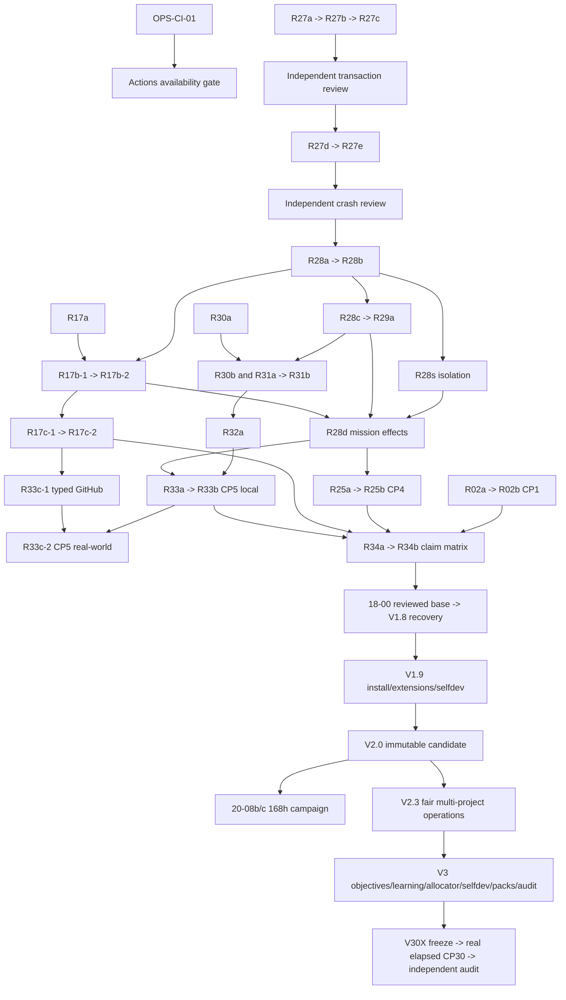

# Dependency graph through V3.0

Closure revision. JSON DAGs are executable truth; generated packet catalog includes every future node/edge. `basis` is provenance, not a completion edge. Entry gates block execution; claim gates block claims. Split/remediation aggregate completion includes every child.

Mermaid is a program summary, not every implementation edge. Exact branches: `19-01` uses R28d/R27d without waiting on an unrelated external issue; `20-01` can integrate after 18-08 and installed extension/upgrade/selfdev code while 18-09/19-08 live proof remains mandatory for review. `23-09/10` also require the V2.0 checked baseline. R34b may report external-pending; it cannot award a working claim without R33c-2. All V30A nodes, including learning-version integration A007, feed CP30 directly or transitively.

Independent gated chains: R06->R07->R08 qualification, R09->R10 remote overlap, R07+R10->R11->R12 24h campaign, R18 physical host proof. Missing lower-version acceptance never disappears when later implementation advances. Reviewholds and environment gates are JSON records with evidence_refs; a bare status or assumed availability cannot satisfy them.

Run `tools/validate_plan.py --ready` for the reviewed-adoption candidate-ready V1.7 set. It checks both ordinary dependency cycles and split/remediation completion cycles. Use the generated catalog for V1.8+ contracts; do not dispatch coarse V18/V23 group aliases as executable packets.
