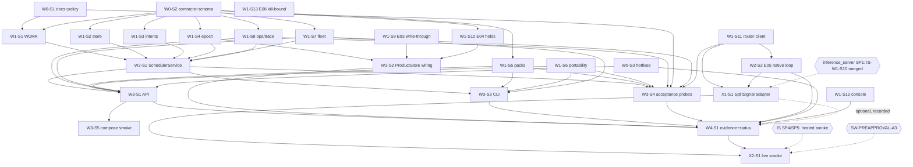

# SwarmAI → V2.3 implementation-complete: multitask plan

Companion to `AUDIT.md` and `OWNER_PREFLIGHT.md`. In the repo these live at `docs/plans/v2.3/` (branch `cursor/v23-plan-460c`). Baseline: `origin/dev` @ `8e1c0fdec24c131e7612d88076220945230f4c3b`, `origin/main` @ `08b910f981eff2ab66873a71055090f2c60f2a91`.
Target: every item of the "V2.3 implementation-complete" checklist (`docs/coordination/FUTURE_VERSION_EXIT_CHECKLISTS_20260921.md`) true on the integration branch `cursor/sw-v23-integration-460c`, with ART-V23 acceptance items 1–10 as a frozen deterministic harness, the SplitSignal adapter tested offline and smoke-tested live (SP4/SP5), and multi-process/private evidence complete or **honestly pending**. The owner then merges integration into `dev` (C1).

## 0. Owner and coordinator decisions (2026-09-25/26)
| ID | Decision | Effect on this plan |
|---|---|---|
| D1 | Every third-party account uses Sign in with Google as the owner's Google account (named in the inference_server preflight); all exist; Codex has read access | No session creates or signs into an account |
| D2 | Independent reviewer = Codex | Every prompt ends with a "Codex review packet" (PR placeholder, head SHA command, files, focus per AGENTS.md Code Review Rules) |
| D3 | Only cross-repo dependency: SplitSignal issues SwarmAI a key; SwarmAI calls it as an OpenAI-compatible API | Only SW-X1-S1/SW-X2-S1 touch inference_server facts, read-only |
| D4 | Both projects finish V2.3 together via sync points | SYNC POINTS table (§5.2) |
| D5 | All owner blockers in one preflight; bundle "Approved"; nothing may block partway | `OWNER_PREFLIGHT.md`; every gate is checked at a session's Step 0 and ends in a STOP-and-push, never a wait |
| D6 | Secrets in `~/Desktop/splitsignal-swarmai-secrets.env` (`# --- swarmai ---`), then Cursor Secrets; swarmai is public | `SECRETS_SWARMAI_SECTION.md`; preflight R-1 |
| B-01 | "Get to V2.3 for both projects" lifts `pause: true` (owner decision, 2026-09-26) | SW-PREAPPROVAL-A1 APPROVED; recorded by the plan commit and SW-W0-S1 |
| C1 | Agents never merge into `dev`/`main`. Integration branch `cursor/sw-v23-integration-460c` (from `origin/dev`); every session branches from it and opens a draft PR to it; SW-MERGE-<wave> prompts merge after checks pass; owner merges integration into `dev` | Replaces HL-07 "PRs target dev" for V2.3; "merged to dev" means "merged into `cursor/sw-v23-integration-460c`" everywhere |
| C2 | inference_server integration branch is `cursor/is-v23-integration-460c` | All SP checks use it |
| C3 | D-SS1 coordinator-accepted (owner may override): listed route = free; refuse only a known non-zero cost; unknown cost = `null`, never zero, never releases budget (F-13) | `SplitSignalReceipt.cost_amount=None` → `usage_known=False` |
| C4 | inference_server `/v1/models` will return `{"object":"list","data":[...]}` | SwarmAI still accepts both `data` and `items` |
| C5 | Env names exactly `SPLITSIGNAL_BASE_URL` (public URL + `/v1`), `SPLITSIGNAL_API_KEY`, `SPLITSIGNAL_MODEL` (default `gemini/gemini-3.5-flash-lite`) | Unset model falls back to the default; never a blocker |
| IS C6 | inference_server merges REVIEW REQUIRED sessions after checks, labelled `Codex review pending` | SW-MERGE commits use the same label |
| IS C8 | inference_server skips deploy/live steps while the owner secrets are missing | SP3–SP5 appear only after IS-W2-DEPLOY runs with secrets; SW-X2-S1 gates on the SP marker lines (§5.2) |
| Joint | One joint plan for both repos: `docs/plans/v2.3/JOINT_PLAN.md` (identical in both repos): owner preflight, joint schedule, launch list, resume procedure, joint acceptance | Approval IDs are namespaced: **SW-An** = `SW-PREAPPROVAL-An` here; **IS-An** = `PREAPPROVAL-An` in inference_server. SW-A3 (live smoke) and IS-A3 (plans) are different approvals, as are SW-A5 and IS-A5 |

## 1. Operating rules for every session
- Branch from the current `origin/cursor/sw-v23-integration-460c`; draft PR to it; never `dev`/`main`, never merge a PR, never force-push. Only `SW-MERGE-*` prompts push to the integration branch. Only SW-W0-S1 may create it (from `origin/dev`), if it is missing.
- If the environment forces a branch suffix, append it once to the session branch and record the exact name. The integration branch already ends in `-460c`; never add a second suffix.
- Every prompt has STOP conditions S1–S8 (dirty tree, missing dependency, a check still failing after 2 attempts, a before-block mismatch, an out-of-scope file, a missing env var, an external gate failure, a push failing after 4 retries). STOP = WIP commit, handoff `BLOCKED`, push, `[BLOCKED]` draft PR, final message.
- Each session (and each MERGE run) uses its own PostgreSQL database `swarm_<session id lowercase>` via `SWARM_DATABASE_URL`, because concurrent sessions on one host collide on a shared database (executor finding, `PROMPT_FIXES.md`).
- One session = one branch = one PR = the files listed in its prompt. Nothing else.
- Only **SW-W0-S2** adds an Alembic migration or edits `src/swarm/db/models.py`. Only **SW-W0-S1 / SW-W4-S1** edit `docs/agents/*`, `docs/v2.3/STATUS.md`, `CHANGELOG.md`, `README.md`. Every session writes its own handoff `docs/v2.3/sessions/<SESSION_ID>.md` (disjoint files, no conflicts).
- A session starts only when every dependency's files exist on `origin/cursor/sw-v23-integration-460c` (each prompt gives the exact `git cat-file -e` checks). `SW-MERGE-<wave>` merges a wave's PRs after checks pass, labelled `Codex review pending`; Codex reviews each PR and the merged range (D2).
- Before every pytest run: `git clean -fdX -- var/` (F-15: stale `var/api/idempotency.json` makes re-runs fail). Before every commit: `git checkout -- schemas/v1 docs/evidence/fix-004 var` (tests rewrite these tracked files).
- New test file basenames must be unique across `tests/` (several test dirs have no `__init__.py`; duplicate basenames break collection).
- Console worker drain/revoke (W1-S12) is coded against `POST /v1/workers/{worker_id}/drain` and `POST /v1/workers/{worker_id}/revoke`, which W3-S1 implements in `routes_v23.py`; until then the UI shows "not available" on 404.
- Zero spend. No real model calls, except SW-X2-S1 under SW-PREAPPROVAL-A3 (≤2 calls, `max_tokens` 16, free route, $0). `accepted` flags stay false.

## 2. Waves

Sessions whose dependency list says **none** may start immediately, in parallel with Wave 0.

### Wave 0 — contracts, tracking, hotfixes (serialization point)
| Session | Title | Depends on | Est. size |
|---|---|---|---|
| SW-W0-S1 | Tracking reset, lift-pause record, honest V2.3 status, frozen scheduler policy + acceptance manifest; creates the integration branch if missing and merges the plan branch `cursor/v23-plan-460c` first (Step 0) | none (B-01 lifted 2026-09-26) | docs/JSON |
| SW-W0-S2 | V2.3 shared contracts (`contracts/v23.py`), `scheduling` package, ORM rows, **single migration** `a23opsplatform0001` | none | ~450 LOC |
| SW-W0-S3 | Security hotfixes: ops-events cross-project leak (F-01), Retry-After cap (F-06) | none | ~120 LOC |

### Wave 1 — independent building blocks (max parallelism; 13 sessions)
| Session | Title | Depends on |
|---|---|---|
| SW-W1-S1 | Weighted-deficit round-robin selector (pure, deterministic) | W0-S1, W0-S2 |
| SW-W1-S2 | Durable `SchedulingStore` (in-memory + PostgreSQL) | W0-S2 |
| SW-W1-S3 | `DispatchIntent` reservation/compensation service | W0-S2 |
| SW-W1-S4 | Scheduler epoch lease + singleton ticker (V20-E06 infra, V23A-003b) | W0-S2 |
| SW-W1-S5 | Capability-pack lifecycle + keyed HMAC signing (F-02) | W0-S2 |
| SW-W1-S6 | Portability bundle v2 (history/receipts/knowledge/tombstones, remap, compat, value-based secret scan) (F-03) | none |
| SW-W1-S7 | Fleet trust classes (ART names) + drain state machine + deterministic placement | W0-S2 |
| SW-W1-S8 | Durable ops-event sink + trace graph + nested redaction | W0-S2 |
| SW-W1-S9 | V20-E03 pursuit PostgreSQL write-through store | none |
| SW-W1-S10 | V20-E04 durable usage holds + pursuit lessons stores (F-04) | W0-S2 |
| SW-W1-S11 | inference_server HTTP client + fake router fixture (packet P05; V20-E05/E07 enabler) | none |
| SW-W1-S12 | Console: Ops tab (read-only) + worker drain/revoke parity (V20-E09) | none |
| SW-W1-S13 | V20-E08 sandbox cancel kill-bound (process group, ≤10 s) — optional | none |

### Wave 2 — integration of the scheduler and native loop
| Session | Title | Depends on |
|---|---|---|
| SW-W2-S1 | `SchedulerService` (WDRR + store + intents + epochs + site epoch + receipts + ops events) + pathological suite; rewire `ResourceAllocator` | W1-S1, W1-S2, W1-S3, W1-S4, W1-S7, W1-S8 |
| SW-W2-S2 | V20-E05 bounded native model/tool loop behind fake router; honest V20-E07 blocked path | W1-S11 |

### Wave 3 — product surfaces and acceptance harness
| Session | Title | Depends on |
|---|---|---|
| SW-W3-S1 | API: `routes_v23.py` (scheduler/ops/trace/packs/portability/fleet + worker drain/revoke by path) + `app.py` wiring; durable only with `SWARM_V23_DURABLE=1` | W2-S1, W1-S5, W1-S6, W1-S7, W1-S8, W0-S3 |
| SW-W3-S2 | ProductStore durability wiring: E03 write-through, E04 holds/lessons restore, E06 singleton pursuit ticker | W1-S4, W1-S9, W1-S10 |
| SW-W3-S3 | Offline CLI `swarm v23 …` (policy, simulate, pack sign/verify, export/import) in `cli_v23.py` + 3 hook edits in `cli.py` | W2-S1, W1-S5, W1-S6, W1-S7 |
| SW-W3-S4 | V2.3 deterministic acceptance probes A01–A10 (`acceptance/v23_probes.py` + tests) | W2-S1, W1-S5, W1-S6, W1-S7, W1-S8, W1-S11, W0-S1 |
| SW-W3-S5 | V20-E10 product compose full-path smoke (Docker; honest `blocked_env_no_docker`) — optional | W3-S1 |

### Wave X — cross-repo, gated on inference_server (runs in parallel with Wave 3/4)
| Session | Title | Depends on |
|---|---|---|
| SW-X1-S1 | SplitSignal consumer adapter (`SplitSignalClient` subclass of `RouterClient`; `SPLITSIGNAL_*` env wins in `native_loop_from_env`; D-SS1/C3; unknown cost never settles) | W1-S11, W2-S2, **external SP1** (IS-W1-S10 merged into `cursor/is-v23-integration-460c`) |
| SW-X2-S1 | SplitSignal live smoke `scripts/v23_splitsignal_smoke.py` (SP4 text, SP5 stream, SP6 contract check); sanitized evidence `docs/evidence/v23/splitsignal_live.json`; EXIT_CHECKLIST row + STATUS SP table | X1-S1, W4-S1, **SW-PREAPPROVAL-A3**, **external SP4** (SP5 for the stream call); env `SPLITSIGNAL_BASE_URL`, `SPLITSIGNAL_API_KEY` |

SW-X1-S1 is **not** a dependency of W4-S1. If it is merged first, W4-S1 records the adapter as `done (fake SplitSignal; live pending SP4)`, otherwise as `pending (gate SP1)`. Its owned files overlap no Wave 3/4 session: `native_loop.py` and `test_v20_native_loop.py` belong to W2-S2, which must be merged before it starts. SW-X2-S1 runs last: its exit codes are 0 pass, 1 fail, 3 blocked (no network call when a gate is missing). The only permitted second run is `blocked:model_not_listed` with exactly one listed `gemini/` id.

### Merge prompts (C1)
`SW-MERGE-W0`, `-W1`, `-W2`, `-W3`, `-W4`, `-X` (6 files). Each one merges the wave's session branches (the prompt's branch name, or the executor's `cursor/<lowercase id>-*`) into `cursor/sw-v23-integration-460c` with `--no-ff`. It skips sessions whose handoff is already in the tree or whose Status is `BLOCKED`. It runs the full verify on the merged tree; if that fails it re-merges one at a time and drops the failing session. Then it pushes and writes a Codex review packet for the range. Every merge prompt also merges `cursor/v23-plan-460c` if it is not already an ancestor; on conflicting hunks the integration side wins (`-X ours`), because sessions own those files. The executor had already merged W0 before the plan branch existed, so the next merge run does this. The next wave starts only when every required session of the current wave is merged.

### Wave 4 — serialization: evidence, status, candidate
| Session | Title | Depends on |
|---|---|---|
| SW-W4-S1 | Campaign runner, evidence under `docs/evidence/v23/`, exit checklist with citations, status/agents/CHANGELOG/README update, CandidateManifest schema constant (F-14), admin-gate candidate freeze (F-16) | all required sessions merged (W3-S5, W1-S13 optional) |

Then: `SW-MERGE-W4` → (wait for inference_server IS-W8-MERGE, JOINT_PLAN §3) → SW-X2-S1 → `SW-MERGE-X` → Codex review of the integration range (B-03) → the owner merges integration into `dev` (C1) → later `dev`→`main` merge and tag (B-07, owner only).

### Wave FIX — follow-up fixes after W4-S1 (EXECUTED 2026-09-26 by the integrator)
| Session | Title | Depends on | Status |
|---|---|---|---|
| SW-FIX-RETRY | RetryOwner gives up when `Retry-After` exceeds `max_retry_after_seconds` (`retry_after_exceeds_cap`); SplitSignal rule | W4-S1 (from X1-S1 finding) | **EXECUTED** — merged `b3162712` |
| SW-FIX-COMPOSE | Compose `worker` process healthcheck (was inheriting the API HTTP check); V20-E10 smoke re-run | W3-S5 | **EXECUTED** — merged `e5fd04c0` |
| SW-FIX-ALEMBIC | Whole-repo pytest isolation: V20-S11 probe restores `SWARM_*`; Alembic tests pinned to their DB | W4-S1 | **EXECUTED** — merged `604f7ace` |
| SW-FIX-FLAKE | Deterministic V20-E08 kill-bound tests (reaped-zombie race; cancel after grandchild exists) | W1-S13 | **EXECUTED** — merged `1b3f48ad` |

Each fix branch (`cursor/sw-fix-*-460c`) was merged into `cursor/sw-v23-integration-460c` with `--no-ff` after ruff, mypy, one Alembic head, the offline CI list and the Postgres integration run passed on the tip. A docs follow-up (`cursor/sw-fix-w4-docs-460c`, merged `be4f62ff`) re-ran the W4-S1 campaign and updated EXIT_CHECKLIST/STATUS. Status: implemented / offline-tested; Codex review pending.

## 3. Dependency graph

Every arrow above is realised by a `SW-MERGE-<wave>` run: a dependency counts as met only once the dependency's files are on `origin/cursor/sw-v23-integration-460c`.

Critical path: W0-S2 → W1-S1/S2/S3/S4/S7/S8 → W2-S1 → W3-S1/S3/S4 → W4-S1 (5 merge rounds). Maximum concurrency: Wave 0 + "none"-dependency Wave 1 sessions = **9 sessions at once** (W0-S1, W0-S2, W0-S3, W1-S6, W1-S9, W1-S11, W1-S12, W1-S13 + one spare), then 7 more when W0-S2 lands.

## 4. File-ownership matrix
"C" = create, "M" = modify. No file appears under two sessions that can run at the same time. The only sequential overlap is SW-X1-S1: it modifies three files created by W1-S11/W2-S2, and it starts only after both are merged. Handoff files `docs/v2.3/sessions/<ID>.md` are owned by their session and omitted below.

| Session | Owned files |
|---|---|
| SW-W0-S1 | M `docs/agents/CURRENT.md`, M `docs/agents/context.json`, M `docs/agents/RESUME.md`, M `docs/agents/V20_TODO.md`, M `docs/agents/README.md`, M `docs/v2.3/STATUS.md`, C `docs/v2.3/sessions/README.md`, M `docs/v3.0/STATUS.md`, M `CHANGELOG.md`, C `config/v23/scheduler_policy.v1.json`, C `benchmarks/v23_acceptance/scenarios.freeze.json` |
| SW-W0-S2 | C `src/swarm/contracts/v23.py`, C `src/swarm/scheduling/__init__.py`, C `src/swarm/scheduling/memory_store.py`, M `src/swarm/db/models.py` (append only), C `migrations/versions/a23opsplatform0001_v23_ops_platform.py`, M `tests/integration/db/test_action_receipts_durable.py` (`NEW_HEAD` constant only), C `tests/contracts/test_v23_contracts.py`, C `tests/controller/test_v23_store_memory.py`, C `tests/integration/db/test_v23_schema.py` |
| SW-W0-S3 | M `src/swarm/api/routes_v1.py` (only function `list_ops_events`), M `src/swarm/broker/retry.py`, C `tests/api/test_v23_ops_events_scope.py`, C `tests/broker/test_retry_after_cap.py` |
| SW-W1-S1 | C `src/swarm/scheduling/wdrr.py`, C `tests/controller/test_v23_wdrr.py` |
| SW-W1-S2 | C `src/swarm/scheduling/store.py` (`SqlSchedulingStore`), C `tests/integration/db/test_v23_store_sql.py` |
| SW-W1-S3 | C `src/swarm/scheduling/dispatch_intent.py`, C `tests/controller/test_v23_dispatch_intent.py` |
| SW-W1-S4 | C `src/swarm/scheduling/epoch.py`, C `src/swarm/scheduling/singleton.py`, C `tests/controller/test_v23_epoch.py`, C `tests/integration/db/test_v23_epoch_sql.py` |
| SW-W1-S5 | M `src/swarm/capabilities/__init__.py`, C `src/swarm/capabilities/signing.py`, C `src/swarm/capabilities/lifecycle.py`, C `tests/extensions/test_v23_pack_lifecycle.py`, C `tests/integration/db/test_v23_pack_installs_sql.py` |
| SW-W1-S6 | M `src/swarm/product/portability.py`, C `tests/portability/test_v23_bundle.py` |
| SW-W1-S7 | M `src/swarm/workers/fleet.py`, C `tests/workers/test_v23_fleet_policy.py` |
| SW-W1-S8 | M `src/swarm/observability/ops_events.py`, M `src/swarm/observability/__init__.py`, C `src/swarm/observability/trace_graph.py`, C `tests/controller/test_v23_ops_trace.py`, C `tests/integration/db/test_v23_ops_events_sql.py` |
| SW-W1-S9 | C `src/swarm/pursuit/pg_mirror.py`, M `src/swarm/pursuit/state_store.py`, C `tests/pursuit/test_v20_writethrough.py`, C `tests/integration/db/test_v20_pursuit_writethrough_sql.py` |
| SW-W1-S10 | C `src/swarm/pursuit/durable_accounting.py`, M `src/swarm/pursuit/accounting.py`, M `src/swarm/pursuit/learning.py`, C `tests/pursuit/test_v20_unknown_usage_budget.py`, C `tests/pursuit/test_v20_durable_holds.py`, C `tests/integration/db/test_v20_holds_sql.py` |
| SW-W1-S11 | C `src/swarm/providers/router_client.py`, C `src/swarm/contracts/router_capabilities.py`, C `tests/fixtures/__init__.py`, C `tests/fixtures/router_http/__init__.py`, C `tests/fixtures/router_http/fake_router.py`, C `tests/providers/test_router_client.py`, C `config/router_context_overrides.example.json`, C `docs/swarm-mvp/INFERENCE_SERVER_CONTRACT_SNAPSHOT.md` |
| SW-W1-S12 | M `apps/console/src/App.tsx`, M `apps/console/src/api/client.ts`, M `apps/console/src/api/types.ts`, M `apps/console/src/data/fixtures.ts`, C `apps/console/src/components/OpsPanel.tsx`, C `apps/console/src/components/WorkerControls.tsx`, C `apps/console/src/ops.test.tsx` |
| SW-W1-S13 | M `src/swarm/tools/sandbox_runner.py`, C `tests/tools/test_v20_cancel_killbound.py` |
| SW-W2-S1 | C `src/swarm/scheduling/service.py`, M `src/swarm/controller/resource_allocator.py`, C `tests/controller/v23_harness.py` (shared helper), C `tests/controller/test_v23_service.py`, C `tests/controller/test_v23_pathological.py`, C `tests/integration/db/test_v23_service_restart_sql.py` |
| SW-W2-S2 | C `src/swarm/pursuit/native_loop.py`, M `src/swarm/pursuit/native_dispatch.py`, C `tests/pursuit/test_v20_native_loop.py` |
| SW-X1-S1 | C `src/swarm/providers/splitsignal_client.py`, C `tests/fixtures/splitsignal_http/__init__.py`, C `tests/fixtures/splitsignal_http/fake_splitsignal.py`, C `tests/providers/test_splitsignal_client.py`, C `tests/pursuit/test_v20_native_loop_splitsignal.py`, M `src/swarm/pursuit/native_loop.py` (one import + `native_loop_from_env`; after W2-S2), M `tests/pursuit/test_v20_native_loop.py` (one `delenv` line; F-19), M `docs/swarm-mvp/INFERENCE_SERVER_CONTRACT_SNAPSHOT.md` (append a section; after W1-S11) |
| SW-X2-S1 | C `scripts/v23_splitsignal_smoke.py`, C `tests/providers/test_v23_splitsignal_smoke.py`, C `docs/evidence/v23/splitsignal_live.json`, M `docs/v2.3/EXIT_CHECKLIST.md` (the SplitSignal row only; after W4-S1), M `docs/v2.3/STATUS.md` (append one section; after W4-S1) |
| SW-W3-S1 | C `src/swarm/api/routes_v23.py`, M `src/swarm/api/app.py`, C `tests/api/test_v23_routes.py`, C `tests/integration/db/test_v23_routes_durable_sql.py` |
| SW-W3-S2 | M `src/swarm/api/store.py`, M `src/swarm/pursuit/loop.py`, C `tests/product/test_v20_durable_wiring.py`, C `tests/integration/db/test_v20_durable_wiring_sql.py` |
| SW-W3-S3 | C `src/swarm/cli_v23.py`, M `src/swarm/cli.py` (3 hook edits only), C `tests/product/test_v23_cli.py` |
| SW-W3-S4 | C `src/swarm/acceptance/v23_probes.py`, C `tests/acceptance/test_v23_acceptance.py` |
| SW-W3-S5 | C `scripts/v20_compose_smoke.sh`, C `docs/evidence/v20/compose-smoke/README.md`, C `docs/evidence/v20/compose-smoke/latest.json` |
| SW-W4-S1 | C `scripts/v23_acceptance_campaign.py`, C `docs/evidence/v23/**`, C `docs/v2.3/EXIT_CHECKLIST.md`, M `docs/v2.3/STATUS.md`, M `docs/v2.0/STATUS.md`, M `docs/agents/*`, M `CHANGELOG.md`, M `README.md`, M `src/swarm/release/candidate.py` (add `CURRENT_SCHEMA_REVISION`), M `src/swarm/cli.py` + `src/swarm/api/routes_v1.py` (replace the literal `"a18tov30schema0001"` with that constant; admin-gate `POST /v1/release/candidate-freeze`; F-14, F-16), C `tests/release/test_schema_revision.py` |

### Serialization points (single owner, do not parallelize)
1. `src/swarm/db/models.py` + `migrations/versions/*` — SW-W0-S2 only (one new head `a23opsplatform0001`).
2. `src/swarm/contracts/v23.py` — SW-W0-S2 creates; later sessions **import only**. If a session needs a new field, it records "Needs other owner" in its handoff; the coordinator schedules a follow-up contract PR.
3. `src/swarm/api/app.py`, `src/swarm/api/store.py`, `src/swarm/cli.py` — Wave 3 single owners.
4. `docs/agents/*`, `docs/v2.3/STATUS.md`, `CHANGELOG.md` — the plan commit (append-only), then W0-S1, then W4-S1, then SW-X2-S1 (STATUS append only).
5. `.github/workflows/ci.yml` — **nobody**. All new tests live in directories CI already runs (`tests/controller`, `tests/api`, `tests/broker`, `tests/extensions`, `tests/portability`, `tests/workers`, `tests/pursuit`, `tests/providers`, `tests/tools`, `tests/product`, `tests/acceptance`, `tests/contracts`, `tests/integration` with `pytestmark = pytest.mark.integration`).

### Frozen internal API shapes (W1-S12 console ↔ W3-S1 routes; parallel sessions code against these)
- `GET /v1/scheduler/queues` → `{"projects":[{project_id, tenant_id, weight, credit, running, max_concurrency, paused, version}]}` (non-admin: own projects only).
- `POST /v1/workers/{worker_id}/drain` and `/revoke`, body `{"reason": str}` → `{"worker_id", "drain_state"}`. Console treats 404 as "not available on this server". A worker with no `project_id` is admin-only. The legacy body-based `/v1/workers/drain|revoke` is unchanged.
- `GET /v1/ops/events` → `{"events":[...]}` (W0-S3 scoping); `GET /v1/ops/trace/{id}` → `TraceGraph.to_dict()`; a foreign trace gives 404.

### Durability flag (W3-S1 and W3-S2 share it; neither imports the other)
`SWARM_V23_DURABLE=1` **and** a reachable database switch the V2.3 scheduler/packs/ops state (W3-S1) and pursuit mirror/holds/lessons/ticker epoch (W3-S2) to PostgreSQL. Default off: behaviour is unchanged from `dev`. Turning it on in any environment is an operator decision.

### Validation of the reference code
Every session's code was compiled and run on a scratch clone (`dev @ 8e1c0fde` plus all 24 sessions applied in wave order). Result on the integrated tree: `uv run pytest` 763 passed / 1 skipped, the Postgres integration tests passed, ruff and mypy clean, 10/10 V23 probes pass. The W3-S5 Docker path was **not** executed (no Docker on the audit VM); only its `blocked_env_no_docker` path was. SW-X1-S1 and SW-X2-S1 were validated together on `dev` plus the W1-S11 and W2-S2 references: the offline CI list gave 566 passed / 1 skipped, ruff and mypy were clean, and 34 new tests passed (27 adapter/loop, 7 smoke). Every fake SplitSignal body validates against the SplitSignal openapi schemas. It has not been run against the real `mock_splitsignal.py`, which does not exist on any inference_server branch yet.

## 5. Cross-repo touchpoints with `inference_server`
SwarmAI is a **client only**; no session edits `inference_server` (rule from `docs/swarm-mvp/START_HERE.md`).

| Touchpoint | SwarmAI side | inference_server side (observed @ `cursor/v08-v17-offline-ladder-7ebe` `96af9d4`, plan-pinned `release/v1-build` `bb6b6167`) | Needed from inference_server |
|---|---|---|---|
| Model catalog | `providers/router_client.py::RouterClient.list_models()` (W1-S11) | `GET /v1/models` → `{"object":"list","data":[…]}` per principal | **Additive fields** per model: `context_window`, `max_output_tokens`, `tokenizer`, `supports_tools`, `supports_json`, `billing` (`free`/`paid`/`unknown`). Until then SwarmAI uses `config/router_context_overrides.example.json`. |
| Chat | `RouterClient.chat()` / `chat_stream()` (W1-S11), used by `pursuit/native_loop.py` (W2-S2) | `POST /v1/chat/completions` (OpenAI-compatible, stream + non-stream, tool calls) | Stable tool-call ID preservation; documented `stream_options.include_usage`. |
| Route identity & billing | parse headers into `RouterCallReceipt` | `X-Request-Id`, `X-Router-Route`, `X-Router-Provider`, `X-Router-Upstream-Model`, `X-Router-Billing`, `X-Router-Attempts`, `Retry-After` | Header names frozen as a versioned contract (e.g. `X-Router-Contract: 1`). |
| Errors | map `error.code` → `swarm.contracts.enums.ErrorClass` | `{"error":{"type","code","message"}}`; codes such as `upstream_*`, `deadline_exceeded`, `credential_missing` | Published list of stable codes + which are safe to retry. |
| Retries/fallback ownership | SwarmAI disables HTTP-library retries; semantic retry only via `RetryOwner` (cap from W0-S3) | Router owns transport retry + alias fallback (bounded attempts/deadline) | Confirm max router-side attempts per request so SwarmAI accounting does not multiply. |
| Usage/cost | known vs unknown usage in `RouterCallReceipt`; unknown never = 0 (feeds E04 holds) | `usage` in body (may be absent); `GET /v1/router/usage` ledger (metadata only) | Idempotency-Key header support (unknown) for reconciliation after timeout. |
| Zero-spend | Swarm admits only `X-Router-Billing: free`; anything else → `paid_route_forbidden` | Default policy "free only", fail-closed | None (aligned). |
| MCP mailbox | out of scope for V2.3 | `/mcp`, `/v1/mailbox/*` | none now. |
| Live use | legacy router: retired (X6). SplitSignal: SW-X2-S1 only, under SW-PREAPPROVAL-A3 (§5.2) | hosted SplitSignal from SP4 | none beyond the preflight |

Coordination action for the inference_server coordinator/auditor: propose an additive "capability metadata v1" on `GET /v1/models` and freeze the header set. SwarmAI does not block on it (fixture + override file).

### 5.1 SplitSignal consumer contract (supersedes the legacy router rows above)
The inference_server V2.3 plan (`pri8771/inference_server` `docs/plans/v2.3/PLAN.md` §8 on `cursor/v23-plan-460c`, owner decision D3) makes SplitSignal SwarmAI's **only** inference dependency: an OpenAI-compatible API with a SplitSignal-issued key. The personal router is retired (X6). W1-S11/W2-S2 stay useful: they build the client types, the native loop and the legacy fake. **SW-X1-S1** adds the SplitSignal adapter on top.

| SplitSignal contract fact (`swarmai-consumer 1.x`: first frozen as `1.0.0` against openapi 1.0.0; the openapi document version advances independently, 1.1.0–1.3.0) | SwarmAI mapping in SW-X1-S1 |
|---|---|
| `SPLITSIGNAL_BASE_URL` (ends in `/v1`), `SPLITSIGNAL_API_KEY` (bearer `ss_live_…`), `SPLITSIGNAL_MODEL` | `SplitSignalClient(base_url)` strips `/v1`; `api_key_env="SPLITSIGNAL_API_KEY"`; `native_loop_from_env` prefers `SPLITSIGNAL_*` over `SWARM_ROUTER_*` |
| `GET /v1/models` → `V1ModelList` = `{"object":"list","data":[{"id": RouteId, "object":"model", "created": <unix s>, "owned_by": ProviderId}]}` (OpenAI list shape, no pagination, ≤ 1000 items; only routes usable now; M1 dispatches only `cost_class: free`) | `RouteCapabilities(model_id=id, billing=FREE, admission="admitted")` under **D-SS1** (coordinator-accepted C3; the owner may override); a `ModelPage{items:[ModelOffer]}` body is also accepted, and its `cost_class`, `capabilities.tools/json_output` (`supported` → True) and `limits.*.value` are then authoritative |
| `ChatCompletion.model` = `X-SplitSignal-Served-Route`; `id` = request id; `usage` null if unreported; `splitsignal{requested_route, served_route, attempt_count, usage, cost{amount,currency,source}}` | `SplitSignalReceipt(route_id, provider, upstream_model, attempts, usage_known, cost_amount, cost_currency, cost_source)`; a known non-zero `cost.amount` → `policy_denied/paid_route_forbidden` with `billing: paid`; a `null` amount → `cost_source: unknown` and `usage_known: false`, so the hold is never settled as zero (C3, F-13) |
| SSE: content chunks, a finish chunk with `splitsignal`, a usage chunk (`choices: []`) **only when the request sets `stream_options.include_usage`** (the base client always sets it), `[DONE]`; `: keep-alive` comments are heartbeats; a failure after headers is `event: error` + `ErrorEnvelope` with HTTP status still 200 and no `[DONE]` | the receipt is rebuilt from chunks; a missing `[DONE]` → `partial_stream` with `partial_text` |
| `ErrorEnvelope{error:{code, message, request_id, retryable, retry_after_s?, field_paths?}}`, `X-Should-Retry: false`, `Retry-After` on 429/503 | `classify_splitsignal_error`: fixed code map; any other 5xx with `retryable: false` → `unknown_outcome`; `retry_after_s` from the header. SwarmAI never replays after a 200 header; semantic retry stays with `RetryOwner` (cap from W0-S3). Contract rule: at most 2 retries, only when `retryable` is true, never before `Retry-After` has elapsed; `RetryOwner` clamps waits to 30 s, so SW-X1-S1 checks that a longer `Retry-After` gives up instead of retrying early (open follow-up if not). |
| Rate-limit headers `x-ratelimit-{limit,remaining,reset}-{requests,tokens}`: **optional and informational**; the real server sends none until real quota windows exist (IS AUD-08); the mock sends demo values | ignored by the adapter; never used for admission, budgeting or retry timing |
| Key: `Authorization: Bearer ss_live_<32 lowercase hex>_<43 base64url>` (regex `^ss_live_([0-9a-f]{32})_([A-Za-z0-9_-]{43})$`), generated by the owner (IS SEC-13), imported on the hosted DB by IS-W2-DEPLOY with `python -m splitsignal.admin_keys import-key --label swarmai --scopes models:read,inference:write,usage:read --from-env SPLITSIGNAL_API_KEY`; SplitSignal stores only its SHA-256 digest; rotate ≤ 90 days | read from `SPLITSIGNAL_API_KEY` only; never logged or committed; format checked in JOINT_PLAN §2 |

### 5.2 SYNC POINTS (swarmai sessions ↔ inference_server SP1–SP6, D4)
Same conditions and branch names as inference_server `docs/plans/v2.3/PLAN.md` §8.1: every condition is a file or a column-0 marker line on `cursor/is-v23-integration-460c`; the swarmai integration branch is `cursor/sw-v23-integration-460c`. Each SW check is a read-only `gh api` call (`gh api "repos/pri8771/inference_server/contents/<path>?ref=cursor/is-v23-integration-460c"`). A missing sync point never makes a session wait: its STOP (S7) records the gap and pushes. The joint order of sessions is in `docs/plans/v2.3/JOINT_PLAN.md` §3.

| SP | inference_server condition (on `cursor/is-v23-integration-460c`) | Written by | swarmai session and step that consume it | If not reached |
|---|---|---|---|---|
| SP1 contract frozen | `docs/api/v1/consumers/swarmai.md` exists | IS-W2-MERGE (merges IS-W1-S10) | **SW-X1-S1** Step 0 (gate) | X1 STOPs (S7) before any edit; W4-S1 records the adapter `pending (gate SP1)` |
| SP2 mock testable | `scripts/mock_splitsignal.py` exists | same merge | **SW-X1-S1** Step 8 (optional run on port 8089, synthetic key, model `mock/ok`) | Step 8 skipped and noted; the in-repo fake still covers the contract |
| SP3 key issuable | `docs/evidence/m1/hosted-v05.md` has a line starting `SP3: reached` | IS-W2-DEPLOY step 6 | no session directly; the owner's preflight stored `SPLITSIGNAL_API_KEY` (IS SEC-13) | SW-X2-S1 STOPs at its SP4 gate |
| SP4 live non-streaming | the same file has a line starting `SP4: reached` | IS-W2-DEPLOY step 6 | **SW-X2-S1** Step 0b gate, then the text call in Step 3 | X2 STOPs (S7) with no network call |
| SP5 live streaming | the same file has a line starting `SP5: reached` | IS-W4-MERGE redeploy, or the IS-W6/W8-MERGE fallback | **SW-X2-S1** Step 0b sets `--stream` only when this line exists | text call only; recorded `SP5: not reached`; SP4 evidence is kept |
| SP6 joint finish | `docs/evidence/v2.3-offline.md` contains `swarmai-consumer 1.` and a line starting `SP6: reached` | IS-W8-MERGE step 5 | **SW-X2-S1** Step 4 + **SW-W4-S1** EXIT_CHECKLIST row "SplitSignal consumer adapter" | recorded `SP6: pending`; not a STOP |

Live-call budget: SW-A3 allows at most 2 calls by SW-X2-S1 (`max_tokens` 16) in addition to inference_server's IS-A6 (at most 5 calls, `max_tokens` 64). Both reach the owner's Gemini free-tier BYOK connection; joint maximum 7 calls, $0. SW-X2-S1 is scheduled after IS-W8-MERGE (JOINT_PLAN §3), so one run records SP4, SP5 and SP6 and no re-run is needed.

F-20 is resolved by C4 (inference_server returns `{"object":"list","data":[...]}`). SwarmAI still tolerates both shapes.

## 6. Mapping of V2.3 checklist → sessions
| Checklist item | Sessions |
|---|---|
| scheduler state durable | W0-S2, W1-S2, W2-S1 |
| project-level fairness defined | W0-S1 (policy), W1-S1 |
| aging/priority deterministic | W1-S1 |
| reservation intent transactional/fail-closed | W1-S3, W2-S1 |
| provider/worker/tool capacity integrated | W2-S1 (via injected reserve/release callables), W3-S1 |
| backpressure bounded | W1-S1 (caps), W2-S1 (queue depth/fan-out) |
| cancellation/drain fenced | W1-S1, W1-S3, W1-S7, W2-S1 |
| scheduler bound to SiteEpoch | W1-S4, W2-S1 |
| decision receipts emitted | W0-S2, W1-S2, W2-S1 |
| capability packs lifecycle complete | W1-S5 |
| portability export/import complete | W1-S6 |
| observability read surface complete | W0-S3, W1-S8, W3-S1, W1-S12 |
| dashboard mutation uses action boundary | W3-S1, W1-S12 |
| fleet placement/trust/locality complete | W1-S7 |
| pathological deterministic suite passes | W2-S1, W3-S4 |
| multi-process/private evidence complete or honestly pending | W4-S1 (records pending; B-04) |

V2.0 depth prerequisites: E03 → W1-S9 + W3-S2; E04 → W1-S10 + W3-S2; E05 → W1-S11 + W2-S2 (+ SW-X1-S1 for SplitSignal); E06 → W1-S4 + W3-S2; E07 → W2-S2 + SW-X1-S1 (fake/free) + SW-X2-S1 (live smoke under SW-PREAPPROVAL-A3 at SP4/SP5); E08 → W1-S13; E09 → W1-S12; E10 → W3-S5; E11 deferred.

## 7. Prompts
36 files in `prompts/`: 30 session prompts (`SW-W0-S1` … `SW-W4-S1`, `SW-X1-S1`, `SW-X2-S1`, and the executed follow-ups `SW-FIX-RETRY`, `SW-FIX-COMPOSE`, `SW-FIX-ALEMBIC`, `SW-FIX-FLAKE`) and 6 merge prompts (`SW-MERGE-W0` … `SW-MERGE-W4`, `SW-MERGE-X`). They are generated by `tools/gen_prompts.py` from `tools/bodies/*.md` and the validated reference code in `tools/ref/` (`python3 tools/gen_prompts.py`). The generator refuses to write if any prompt contains "as appropriate", "etc.", "similar to" or "if needed". Each prompt is self-contained. It has an Identity table (integration base, branch-suffix rule, Codex reviewer), hard rules, setup, dependency and env checks, owned files, step-by-step code, verification with a private database, acceptance checkboxes, commit, push, draft PR to integration, handoff, STOP conditions S1–S8 and a Codex review packet.

### 7.1 Prompt index and execution state (integration branch `cursor/sw-v23-integration-460c`; integration → `dev` NOT merged)
| Prompt | State | Integration merge SHA |
|---|---|---|
| `prompts/SW-W0-S1.md` | **EXECUTED** | `dd134248dad645f00a80b384d7fe8da6b3619e02` |
| `prompts/SW-W0-S2.md` | **EXECUTED** | `cfcd412c1dab98e80b0a8f51ff8258dc6a4a2a80` |
| `prompts/SW-W0-S3.md` | **EXECUTED** | `c0c120968ea50344195b1d9b4d58e9870c5590fd` |
| `prompts/SW-W1-S1.md` | **EXECUTED** | `d59a05638bbc2473db18d395694ca19fefa81ac2` |
| `prompts/SW-W1-S2.md` | **EXECUTED** | `7ee30ef3b1594d70056c0a60235efadf7bced929` |
| `prompts/SW-W1-S3.md` | **EXECUTED** | `d628d28dd134474c50adda431ed34cf675090e49` |
| `prompts/SW-W1-S4.md` | **EXECUTED** | `55d15252ea6e3ce93b8941449c445f1c1556e1f5` |
| `prompts/SW-W1-S5.md` | **EXECUTED** | `133ab3529f304d5aa544de87635fb80a56dfccf2` |
| `prompts/SW-W1-S6.md` | **EXECUTED** | `d80ac0e97fcc9171e3ea694d567060fb595325b7` |
| `prompts/SW-W1-S7.md` | **EXECUTED** | `ba4668b02b7f0c7dbbeafc992ecfc7a2f8bb52bd` |
| `prompts/SW-W1-S8.md` | **EXECUTED** | `c99056c968a788dc44741a87f0473166742b8df0` |
| `prompts/SW-W1-S9.md` | **EXECUTED** | `41a2543fc487ab0c4c2ac8d5f9c33be7150546fa` |
| `prompts/SW-W1-S10.md` | **EXECUTED** | `c7a653eea358db2a9c45c3293f81c5d55af65ec2` |
| `prompts/SW-W1-S11.md` | **EXECUTED** | `5d6fd1df11723fa84833dcf59d7fe239669685ff` |
| `prompts/SW-W1-S12.md` | **EXECUTED** | `97c20078f18e5a5bae8a5956686b31e5adda3ee2` |
| `prompts/SW-W1-S13.md` | **EXECUTED** | `fb55bd45f1db573d73a3338a19deaa23805a6c66` |
| `prompts/SW-W2-S1.md` | **EXECUTED** | `1edd99f50b3309e2be9e5b0f072dc5e95340518c` |
| `prompts/SW-W2-S2.md` | **EXECUTED** | `94cdc07bda84e8876a30ddfe1a317fd11aafae39` |
| `prompts/SW-W3-S1.md` | **EXECUTED** | `12c54026d1d941352bca1d678684c57453b6da15` |
| `prompts/SW-W3-S2.md` | **EXECUTED** | `74b885d61d2fef36fe680ddf0ad0260fa2cbd085` |
| `prompts/SW-W3-S3.md` | **EXECUTED** | `7209b18c6a107556da6275f301449f7b1a309b82` |
| `prompts/SW-W3-S4.md` | **EXECUTED** | `fd92d239909b71a72685a7ff3cab2af51d9bc838` |
| `prompts/SW-W3-S5.md` | **EXECUTED** | `10fd924efd866fbaa8ce7348b24aad3019a13ecc` |
| `prompts/SW-W4-S1.md` | **EXECUTED** | `ed388b7bf61066d49082a81b675a57ef945b6272` |
| `prompts/SW-X1-S1.md` | **EXECUTED** (SP1/SP2 reached at IS `9ca12671`; contract blob `1a4a31c9` unchanged; real-mock run in the handoff) | `2b27bc200ec5938715b853eec7156d30c62d3d5c` |
| `prompts/SW-X2-S1.md` | not run (needs SP4 and SW-PREAPPROVAL-A3; SW-X1-S1 is merged) | — |
| `prompts/SW-FIX-RETRY.md` | **EXECUTED** | `b31627121d9d56836374f5dbfad32e579821937c` |
| `prompts/SW-FIX-COMPOSE.md` | **EXECUTED** | `e5fd04c00028b7e89ae749da7d2966ef742bea74` |
| `prompts/SW-FIX-ALEMBIC.md` | **EXECUTED** | `604f7acec2c560cffa39bafd87ab9284e4b9a565` |
| `prompts/SW-FIX-FLAKE.md` | **EXECUTED** | `1b3f48ad2a1d27cb4d485416502cdd3ba2d12796` |
| `prompts/SW-MERGE-W0.md` … `SW-MERGE-W4.md` | superseded: the executor merged each session directly (`merge.sh`); plan branch not yet merged into integration | — |
| `prompts/SW-MERGE-X.md` | not run | — |
