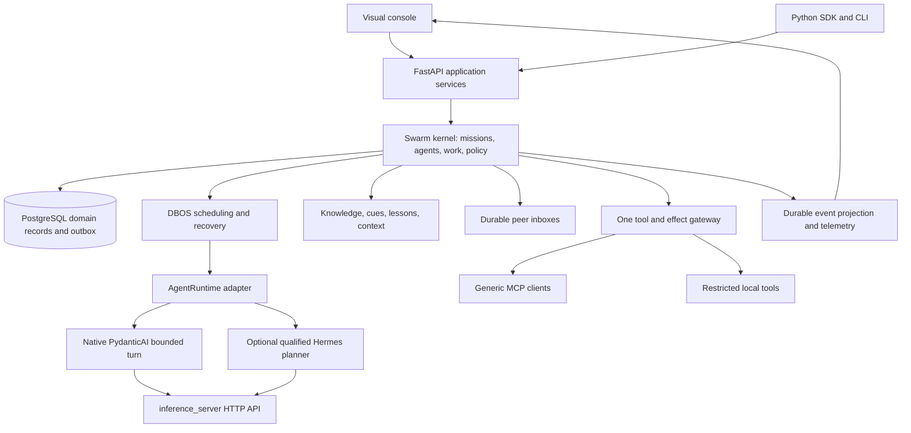

# SwarmAI: autonomous-agent MVP plan

Version 1 · 25 September 2026 · Status: proposed execution baseline; implementation not started by this planning task.

Read alongside [execution packets](EXECUTION_PACKETS.md), [executor handoff](START_HERE.md), and [source audit and research](SOURCE_AUDIT_AND_RESEARCH.md). The packets define implementation order and acceptance. Paths described as **new** are proposed files, not existing features.

## 1. Product decision

Build a developer framework and a visual application for creating, running, and observing a group of autonomous agents pursuing a shared goal. The operator can choose the initial agents, personalities, models, runtime engines, and interaction constraints. Agents decide how to divide work, communicate, seek help, use tools, and improve their approach within those constraints.

The product's distinctive behavior is continuity: agents retain useful experience, recall evidence through compact references, teach one another, and train a successor before their active context becomes full. The system makes this behavior visible and recoverable.

**Hermes can be an optional agent runtime, including for one of the initial planning agents.** A planner is a role; Hermes is an implementation that can fill that role. The operator could start a swarm with a native research agent, a Hermes planning agent, and a native implementation agent. All are peers under the same mission. Hermes does not receive managerial authority merely because it plans. Its adapter becomes available only after passing the same relevant communication, context, tool, and takeover contracts.

CrewAI is a benchmark for ease of defining and running agents and for a useful visual product. The MVP does not require CrewAI as a dependency or crews as execution objects.

### 1.1 What the conversation settles

| Decision | Requirement carried into this plan |
|---|---|
| Collective purpose | Every work item and delegation must contribute to the active mission goal or explicitly approved supporting work. |
| Human-selected agents | Support fully specified seeds, automatic selection, and a mixture. A human can dictate an individual agent's starting definition. |
| Individual autonomy | Agents choose actions; the runtime supplies capabilities, feedback, and enforceable boundaries. Avoid prescribed conversations and fixed planner→builder→reviewer loops. |
| No mandatory crews | A swarm contains agents. Temporary collaboration groups can later be views over participants and messages. No Crew table or crew authority in MVP. |
| Communication | Agents can ask, teach, challenge, negotiate, and share evidence with any permitted peer, including someone without demonstrated expertise in that subject. |
| Context succession | At X% create a trainee and perform KT1; at Y% perform final KT2 and promote the trainee. This is a runtime rule, not advice in a prompt. |
| Memory | Working context, compact recall cues referencing durable records, and full durable memories have distinct responsibilities. |
| Learning | Experience can change future strategies and skills, with evidence and rollback. Saving conversation text alone does not establish learning. |
| Both interfaces | Python SDK and visual application operate on the same saved definitions, commands, and runtime. |
| Generic integrations | MCP is a general connector mechanism. Linear is one possible external server. No dependency on Linear for mission execution. |
| Separate inference product | `inference_server` remains independent and owns upstream provider access and routing. SwarmAI is its client. |
| Optional Hermes | A qualified Hermes runtime can be selected for a seed or permitted delegated agent. Planning is the first bounded integration target. |

These current decisions supersede older crew-centered design notes for this new implementation plan. They do not retroactively mark old milestones accepted or authorize an implementation worker to overwrite another worker's checkout.

### 1.2 Facts, interpretation, and proposals

- **Inspected facts:** Source observations in §2 and the research appendix, pinned to recorded commits. No new product runtime or live-provider qualification was performed in this planning pass.
- **Interpretation:** The user's intended product is an autonomous workforce with collective purpose, persistent experience, and replaceable execution sessions. Human analogies guide the interface; they do not imply human consciousness or automatic weight training.
- **Proposals:** Numerical defaults, API routes, new file placements, deployment shape, and work-packet order below. These give the executor a concrete baseline. Change them through a recorded decision when evidence requires it.

## 2. Current implementation and the gap

### 2.1 Source identity

| Repository/reference | Verified snapshot | Meaning |
|---|---|---|
| `pri8771/swarmai`, main | `08b910f981eff2ab66873a71055090f2c60f2a91` | Main source baseline for this plan. |
| SwarmAI V1.7 candidate | `4d16fe85188861df6e123b4454c6bdc416e6c639` | Separate donor of selected fixes/tests; not a whole-branch merge instruction. |
| SwarmAI coordination branch | `2fcb7bca4e734e147f203ad7168369ec00a14409` | Contains older operational scope/ownership; recheck owner before implementation. |
| `pri8771/inference_server`, dev | `804b28bd7d5878419c4f7a02c7d96b0ea17bf15c` | Matches pasted chat; discovery/planning checkpoint. |
| inference_server, release/v1-build | `bb6b6167c225efbf66b5a4edb6c977e8a79490e4` | Later implementation branch inspected for the HTTP contract. |

No remote SwarmAI `dev` branch was found. The transcript's `dev` belongs to inference_server. The audit checkout and an inference checkout contain existing modifications; preserve them. Revalidate branch identity before execution because repositories may advance.

The referenced ChatGPT conversation contains an audit request and a handoff description, not a completed independent source audit. The subsequent user messages supply the design decisions above.

### 2.2 Architecture observed

Main has FastAPI, a React/Vite console, mission/task contracts, controller/scheduler modules, PostgreSQL models and lease fencing, knowledge repositories, tool/effect gateways, provider brokers, and tests. However, the operational mission loop is a fixed serial repository-worker sequence. Several durable components exist alongside process-local API/controller state instead of owning the execution path.

| Finding | Source evidence | Consequence for this plan |
|---|---|---|
| Fixed sequence and one repository worker | [mission/runtime.py](https://github.com/pri8771/swarmai/blob/08b910f981eff2ab66873a71055090f2c60f2a91/src/swarm/mission/runtime.py#L51) | Build one genuine agent decision loop; keep the coding workflow as an example. |
| API review accepts caller-supplied produced/check values | [api/store.py](https://github.com/pri8771/swarmai/blob/08b910f981eff2ab66873a71055090f2c60f2a91/src/swarm/api/store.py#L435) | Completion must be tied to actual attempts, artifact hashes, and protected check results. |
| Pending worktree can be removed on exit | [mission/runtime.py](https://github.com/pri8771/swarmai/blob/08b910f981eff2ab66873a71055090f2c60f2a91/src/swarm/mission/runtime.py#L261) | Preserve durable artifacts before cleanup. Port and extend donor regression tests. |
| Outbox default callback does nothing, then marks published | [db/outbox.py](https://github.com/pri8771/swarmai/blob/08b910f981eff2ab66873a71055090f2c60f2a91/src/swarm/db/outbox.py#L18) | Require a real dispatcher in operational mode; prove restart delivery. |
| DBOS/PydanticAI only used in a compatibility spike | [spike/durable_agent.py](https://github.com/pri8771/swarmai/blob/08b910f981eff2ab66873a71055090f2c60f2a91/src/swarm/spike/durable_agent.py#L1) | Adopt deliberately and wire it into the product. A dependency is not durable execution. |
| Durable knowledge has versioning, permissions, provenance | [knowledge/repository.py](https://github.com/pri8771/swarmai/blob/08b910f981eff2ab66873a71055090f2c60f2a91/src/swarm/knowledge/repository.py#L34) | Reuse for full memories and evidence; add cue-only retrieval. |
| Retrieval returns full bodies and estimates tokens by words | [knowledge/retrieval.py](https://github.com/pri8771/swarmai/blob/08b910f981eff2ab66873a71055090f2c60f2a91/src/swarm/knowledge/retrieval.py#L31) | Separate search cues from dereferencing and implement explicit context accounting. |
| MCP adapter is a simulated echo | [tools/adapters/api_mcp.py](https://github.com/pri8771/swarmai/blob/08b910f981eff2ab66873a71055090f2c60f2a91/src/swarm/tools/adapters/api_mcp.py#L12) | Build a real generic client and remove simulated success from operational mode. |
| Live console fills tasks with `[]` and agent counts with zero | [console client](https://github.com/pri8771/swarmai/blob/08b910f981eff2ab66873a71055090f2c60f2a91/apps/console/src/api/client.ts#L64) | Display backend projections; unknown and zero are distinct. |
| Learning state is largely a proposal-state prototype | [learning module](https://github.com/pri8771/swarmai/blob/08b910f981eff2ab66873a71055090f2c60f2a91/src/swarm/learning/__init__.py#L9) | Add persisted episodes, evaluations, actual adoption, and rollback. |

No implemented trainee-succession lifecycle or durable peer mailbox was found in the inspected source. Further issues and exact reuse targets are recorded in the source appendix: graph permissions, scheduler dependency handling, legacy memory, gateway bypasses, API durability, and CI omissions.

**Strengths:** useful typed contracts, existing PostgreSQL/fencing/effect foundations, permission-first knowledge, a usable console shell, many focused regression tests, and an unmerged candidate with relevant repairs. **Main risk:** mistaking disconnected components and demonstration paths for an integrated autonomous product. Integration, state ownership, and observable behavior are the first priorities.

## 3. MVP boundary

### Included

One locally installed, single-operator application capable of multiple isolated projects and concurrent swarms on one host; persistent PostgreSQL storage; FastAPI service; React console; Python HTTP SDK; deterministic local demonstration mode; connection to the separate router; generic MCP client; native agent runtime; peer communication; dynamic delegation; reference memory; two-stage succession; a minimal evidence-based learning loop; event timeline; budgets/cancellation/recovery; optional qualified Hermes planning runtime.

The first end-to-end example should combine research/planning and artifact production with fixture data and local tools. It must demonstrate agents choosing useful work and collaboration without hardcoding their dialogue. Keep the existing repository-repair example as another scenario, not the definition of an agent.

### Deferred

Mandatory crews; hosted multi-tenant SaaS; billing customers; distributed worker fleets; mobile apps; general plugin marketplace; automatic self-modification of kernel code; model weight training; unbounded recursive spawning; independent vector service; cross-project global memory by default; autonomous deployment; routine continuous background inference; Swarm MCP server exposure; whole-agent Hermes/Letta migration.

Optional Hermes qualification may proceed alongside later product work. Failure of that adapter must not block a working native MVP. Its unavailable state must be honest in the product.

### Completion levels

1. **Local engineering accepted:** integrated SDK/UI/API behavior passes deterministic and fault-injection checks against real local PostgreSQL, real fixture MCP servers, and a fake HTTP router.
2. **Behavior validated:** explicitly authorized model runs show useful unscripted collaboration, delegation, memory use, learning transfer, and succession continuity on held-out scenarios.
3. **Operator accepted:** the user reviews the evidence and intended workflow. No deployment or publication is implied by either earlier level.

The executor may complete level 1 without provider credentials. It must report level 2 as unverified until real evidence exists.

## 4. Conceptual model and responsibility

### 4.1 Definitions

- **Swarm:** a mission-bound group of logical agents pursuing one collective goal. It includes the goal, work board, shared evidence, resource envelope, and coordination rules.
- **Agent profile:** a versioned definition of personality, preferred work style, role hints, skills, model policy, and runtime choice.
- **Logical agent:** the worker identity the operator recognizes. It survives context replacement and accrues scoped experience. It belongs to one active mission in MVP; a reusable profile is not the same as a shared live agent.
- **Incarnation:** one active context/session of that logical agent, with a generation number. A successor uses a fresh incarnation while preserving the logical identity.
- **Delegated agent:** a new logical worker with a bounded subgoal contributing to the same mission. Its parent is provenance, not unlimited authority over it.
- **Trainee:** a pending next incarnation of the same logical agent, created because context is filling. It shadows and learns before promotion.
- **Crew:** optional human vocabulary for a temporary collaborating subset. It has no required scheduling, permissions, memory, or lifecycle layer in this MVP.
- **Kernel:** deterministic application services enforcing identity, legal state changes, resource limits, permissions, durability, and acceptance. It is not an all-knowing managerial LLM.

### 4.2 Behavioral contracts

| Layer | May choose | Must preserve | Cannot grant itself |
|---|---|---|---|
| Agent | Next useful action; peer to consult; evidence to retrieve; subtask proposal; candidate lesson | Mission goal/version, honesty about uncertainty, bounded action proposals, source references | Permissions, extra budget, verified status, acceptance, unrestricted children |
| Peer interaction | Ask anyone permitted; decline, answer, challenge, teach, negotiate | Authenticated sender, scope, reply correlation, provenance, bounded queues | Task ownership or policy changes through prose |
| Delegated agent | Methods and collaborators within its assignment | Parent mission, assigned result/constraints, contribution trace | A different mission objective or broader access |
| Trainee | Read permitted snapshot/events; ask KT questions; perform readback exercises | No consequential authority before promotion; evidence of gaps | Work claims, external mutations, ordinary delegation |
| Swarm | Replan admitted work toward the collective outcome | Human constraints, shared budget, evidence-backed completion, cancellation | Independent goals beyond its authorization |
| Kernel | Schedule eligible work and enforce policy | One active generation per lineage, durable state, scoped tools, traceability | Invented successful tool results or model understanding |
| Operator | Set/amend goal, choose agents, grant tools, intervene, accept | Visible versioned changes so agents can reconcile them | Past evidence cannot be rewritten as if a different run occurred |

Personality influences tone, curiosity, deliberation, disagreement style, and risk preference within allowed choices. Permissions are separate fields enforced outside prompts. Role hints are not fixed action scripts. An agent can learn a better approach or ask an unexpected peer without changing its tool authority.

## 5. One application architecture



Reuse existing package structure. Do not introduce a microservice for every box. API, kernel, retrieval, messaging, and runtime adapters can be modules in one backend with a separately supervised worker process. PostgreSQL holds domain records; DBOS uses its supported separate system schema/database on the same PostgreSQL service. DBOS internal tables are not an application API. The separate inference router remains a separate product and service.

### 5.1 Single authority rules

1. PostgreSQL domain transactions own mission/agent/work/permission/effect/acceptance state.
2. DBOS owns scheduling/checkpoint/replay mechanics. Completed steps may replay cached results. Current permission, cancellation, lease, and generation checks therefore execute at every fresh domain-command or effect-dispatch boundary; they must not depend solely on checks inside a cached step. Cached model results remain proposals and cannot directly authorize a new effect.
3. All consequential tool calls go through one selected gateway. Remove operational bypasses and simulated production defaults.
4. One router HTTP adapter handles model calls. Swarm owns mission budget and desired capabilities; inference_server owns upstream routes, credentials, transport retries, and fallback.
5. One knowledge repository holds durable memories. Cue/search indexes are rebuildable views. Runtime-private memory cannot silently become a second authority.
6. SDK, CLI, UI, and integration clients invoke the same application commands. No separate SDK execution engine.

DBOS and PydanticAI require a compatibility spike against repository-pinned versions. Current PydanticAI documentation explicitly warns that custom I/O tools and event handlers need durable wrapping and failed steps may repeat. An external effect can remain ambiguous after a crash; no claim of exactly-once remote execution is permitted. [Official integration documentation](https://github.com/pydantic/pydantic-ai/blob/main/docs/durable_execution/dbos.md).

Commit each durable wake event and its outbox row in the same transaction as the domain change. Dispatch with a stable workflow invocation key derived from that event. Repeated delivery must recover the existing invocation rather than start another turn. Mark dispatch acknowledged only after durable DBOS admission. Every turn also claims the expected agent generation/work revision transactionally, so duplicate execution cannot commit twice.

### 5.2 Durable entities

Reuse existing entities when semantics fit; avoid duplicate tables under new names.

| Entity | Required durable fields/invariants |
|---|---|
| Project | ID, operator principal, settings version, retention/scope rules |
| Mission/definition | ID, project, goal, constraints, acceptance spec, seed definitions, model/tool policies, budgets, revision, status |
| AgentProfile | ID/version, personality text and optional structured preferences, role hints, skill refs, runtime ID, model policy; no embedded secrets |
| LogicalAgent | ID, mission, profile version, parent delegation ID, active incarnation/generation, status |
| AgentIncarnation | ID, lineage ID, generation, runtime version, session ref, role active/trainee/retired, context manifest ref, cursors, timestamps |
| WorkItem/Attempt | Goal contribution, dependencies, required scopes, claimed owner generation, lease, attempt, result/artifact refs, verification state |
| Message/Delivery | ID, source identity set by server, recipient logical IDs, mission, kind, body/artifact refs, reply-to, expiry, idempotency key, delivery/read/response state |
| Succession | Unique open succession per lineage, old/new generations, X/Y observations, KT1/KT2 refs, event watermark, readiness, cutover revision |
| ContextManifest | Runtime/model identity, prompt segment hashes, count method, usable capacity, occupancy, cue/fetch refs, policy version |
| Memory/claim/cue | Existing versioned knowledge record, source, scope, digest, event time, claim status, expiry, supersession, cue source ref |
| Experience/Lesson | Situation/action/outcome refs, candidate strategy, scope/preconditions, source ancestry, evaluation refs, adoption/rollback versions |
| Inference/Effect receipt | Stable request/action ID, mission/agent/generation, intent, route or tool version, input hash, status, attempts, actual/estimated usage distinction |
| Event/Outbox | Monotonic per-mission sequence, type/schema version, causation/correlation, payload refs, stable dispatch key |
| Acceptance | Mission/attempt/artifact hashes, protected checks, reviewer, decision and rationale, spec version |

Use UTC timestamps; opaque IDs; schema versions; optimistic revisions for human edits; unique constraints for idempotency and active generations. Large artifacts live in managed local storage with content hashes and DB metadata. Upload/write temporary file, fsync and atomically publish, then record reference; reconcile orphan files. Never delete the only worktree copy before durable artifact publication is verified.

## 6. Agent life and collective coordination

### 6.1 Admission and seeds

The operator sets goal, constraints, expected outcome, starting agents, permissions, and budget. Seed mode is `specified`, `automatic`, or `mixed`. A specified profile includes runtime/model preference and personality. Automatic selection initially uses configured profile templates and a bounded planning proposal; it must not invent providers or connections. The resulting seed roster is saved and shown before execution.

Planning is work on the shared board. Any permitted agent can propose decomposition or challenge a plan. A Hermes planning seed may produce candidate work items, risks, and alternatives. Kernel validation checks graph consistency, permissions, budget, and contribution to the mission. It does not decide whether a plan is insightful merely because it is valid JSON.

### 6.2 Bounded decision cycle

On a durable wake event:

1. Check mission state, generation lease, resource reservation, and cancellation.
2. Read permitted inbox/work changes since durable cursors; materialize bounded relevant context and recall cues.
3. Apply the context threshold rule **before every model call**, including repair, KT, reflection, and adapter-internal calls.
4. Ask the runtime for a structured next-action proposal, with a short user-visible reason and evidence refs. Do not require storage of private chain-of-thought.
5. Validate and execute one bounded action or an explicitly permitted independent batch.
6. Persist result, usage, events, and an experience entry. Release/renew claims appropriately.
7. Schedule another turn only when there is actionable work, a response, a tool result, or a bounded timer. Otherwise wait.

Action types: `claim_work`, `propose_work`, `revise_plan`, `use_tool`, `search_memories`, `read_memory`, `send_message`, `request_help`, `offer_lesson`, `propose_delegation`, `submit_result`, `request_verification`, `wait`, `ask_operator`. These are capabilities; the agent decides their useful order. Structured-output repair is limited and charged to the same budget.

Defaults do not require every task to have a planner, critic, and manager. Introduce specialized agents only when they produce useful independent work. An agent may choose to do a small task itself instead of spawning.

The Swarm `AgentRuntime.step()` contract returns a bounded action proposal and execution metadata. A native or Hermes framework call must not independently execute a consequential tool or schedule a child. Every framework-internal model call requires the same pre-call context/budget check and request receipt; every tool callback uses the kernel gateway. An adapter without enforceable hooks is unqualified even if its public method returns only one result.

### 6.3 Work coordination and disputes

- Every work item includes its contribution to the mission and verifiable completion condition.
- Claims are transactional, leased, and fenced. Two agents can discuss the same work; only an authorized owner can commit that attempt's result.
- Dependencies must be satisfied by accepted prerequisite results. Check actual dependency states and reject graph cycles.
- Proposed scopes must be a subset of mission and agent grants, not merely intersect them.
- Replanning uses expected graph revision; conflicting revisions return an actionable conflict for reconsideration.
- Disagreements carry evidence and alternatives. A peer endorsement is advice. Protected checks and configured review decide acceptance.
- A blocked agent can seek a peer, change method, or ask the operator after a bounded lack-of-progress interval. Waiting is an observable state, not an infinite inference loop.
- Cancellation is mission-wide; propagation fences agents, trainees, delegated work, queued tools, and new inference admission. In-flight irreversible effects may require reconciliation; display them separately.

### 6.4 Delegation

Proposal fields: subgoal, link to work/goal, reason delegation helps, desired capabilities/profile/runtime, expected output, evidence criteria, estimated budget, allowed scopes, parent dependency, maximum duration. The kernel admits or returns a reason. A child remains part of the same swarm. Completion reports contribute artifacts to the mission even if its original parent later retires.

Enforce active-lineage, total-spawn, depth, per-mission inference, and tool concurrency limits. Detect repeated substantially identical child work by work identity/idempotency, then expose a duplicate-work warning for uncertain semantic cases. Do not claim deterministic semantic deduplication of arbitrary prompts.

Succession does not consume delegation depth or create a new independent subgoal. Its cost still counts toward the mission budget.

## 7. Communication

### 7.1 Internal messages

Use durable addressed messages between logical agent IDs and a bounded mission announcement stream. Store source incarnation/generation for audit. Resolve current recipient incarnation at delivery. Agent display names, MCP arguments, or message text cannot impersonate a sender. Human messages carry an authenticated operator principal.

Message kinds: question, answer, suggestion, evidence, challenge, lesson offer, lesson feedback, work negotiation, status, KT question. A message has `reply_to`, topic/work refs, deadline, attachment refs, priority within operator bounds, and whether a response is requested.

Track `persisted`, `delivered`, `read_by_turn`, `responded`, and `expired`. Reading does not prove comprehension or agreement. Acknowledgment of a command is not proof of completed work. Use at-least-once delivery with deduplicated processing and durable cursors; do not promise exactly-once cognition.

Human messages can target one agent or the mission. A goal/permission change uses a separate versioned command, not ambiguous conversational text. The UI can offer to turn a chat instruction into a concrete command.

### 7.2 Who may talk to whom

Default: same-mission agents may message each other, subject to data scopes and operator interaction policy. Cross-mission/private-agent memory sharing is denied unless explicitly enabled. Personality may favor particular collaboration patterns. The operator can restrict audiences, broadcast volume, confidentiality, unsolicited interruptions, and human-escalation behavior.

The peer directory lists role hints, skills, availability, and evidence-backed experience by subject. It must allow an agent to ask a peer with no matching expertise. That peer can say it does not know, suggest an experiment, or provide an analogy. The recipient evaluates the advice and cites its evidence; unfamiliarity is not a blanket communication prohibition.

### 7.3 Prevent communication from consuming the mission

Batch inbox delivery by bounded tokens/count, debounce low-priority notifications, set request deadlines, coalesce duplicate wake events, and cap repeated reply chains without work/evidence progress. Unsolicited replies do not automatically wake every agent. Rate limits are visible policy with reason codes. Agents can refuse or postpone help and should retain their active commitments.

MCP is for external integrations. The mission mailbox lives in SwarmAI's database. An external mailbox can later bridge selected messages while preserving source identity and authorization; it never becomes the work-ownership database.

## 8. Memory and context

### 8.1 Three layers

| Layer | Contains | Storage/use |
|---|---|---|
| Working context | Goal/constraints, active task, recent relevant interactions, critical facts, tool schemas, selected fetched evidence | Model input for the current decision; bounded and accounted |
| Recall cues | Brief descriptive cue plus immutable memory ID/version/digest, source/time/status, applicability | Durable index; only a relevant bounded selection enters context |
| Long memory | Full experiences, artifacts, evidence, decisions, claims, lessons and their versions | Existing knowledge store plus durable artifact storage; retrieved on demand |

The user’s “I think I remember” layer is the cue system. It tells an agent where to check. Finding a referenced record confirms that the record exists; it does not by itself confirm the claim. Important actions require checking the current accessible source and relevant evidence.

References in context are efficient for large, infrequently needed content. Small, frequently used facts and active constraints belong directly in context, with provenance. Reference-only prompts can cost more when repeated fetches exceed the saved tokens. Instrument the tradeoff instead of assuming references are always cheaper.

### 8.2 Retrieval contract

`search_cues(query, scope, token_budget)` returns only permitted cue metadata; `read_memory(ref, section, token_budget)` returns a bounded source excerpt and receipt. Permission filtering happens before ranking, counts, previews, and content. A title or cue can leak information too. Cross-scope error messages must not reveal record existence.

Typed outcomes: available, stale, superseded, tombstoned, unavailable, conflicting. Recheck access at dereference, even for a cue already in context. Pin the version used in an attempt; show newer versions as changes to reconsider. A corrected memory supersedes old versions and invalidates relevant cues/adoptions. Preserve historical provenance without presenting a withdrawn claim as current.

Records distinguish observed facts, attributed claims, hypotheses, preferences, and procedures. Evidence status, confidence, and lifecycle are separate. Two peers repeating the same source count as one source lineage. Expiry and contradictions are visible. The agent can save uncertainty; the system need not flatten it to true/false.

Access revocation also invalidates affected context manifests, cached excerpts, pending KT packets, and derived lesson use. Pause affected new calls, rebuild context from currently permitted sources, and recheck before resuming; quarantine late results based on revoked content from further sharing or effect authorization. This protects future use. It cannot erase content already delivered to a model, human, external recipient, or exported artifact; retention/export behavior must be documented honestly.

### 8.3 Scope and retention

Support private lineage memory, mission-shared memory, and explicitly reusable project memory. Shared memory is not a shared unfiltered transcript. Proposal to publish private experience into a shared scope must satisfy source permissions and redaction rules. Promotion cannot widen access beyond its evidence.

Operator controls: inspect a memory and its uses, correct it, revoke sharing, archive/delete with an honest retention policy, reset acquired preferences, export allowed records. Deletion and backup handling are separate; document retention rather than promise erasure from previously exported artifacts. Do not log secrets or raw prompts by default.

### 8.4 Context budget and defaults

For a proposed call, let `C` be the verified context limit for every eligible route; `O` the reserved maximum output; `S` a tokenizer/serialization safety margin; `H` reserved headroom for handoff and bounded pending input. Define normal input capacity `W = C - O - S - H`. Input count `I` includes the full assembled system/developer text, history, messages, tool schemas, retrieved text, cue text, images or other modality accounting, and runtime-added preambles. Occupancy is `I / W`.

Use actual tokenizer accounting when available; otherwise a tested conservative estimator with explicit error bounds and margin. Never call whitespace count exact. Reject a route with unknown usable limits until a verified metadata override is supplied. For fallback aliases, use the smallest eligible window or pin a single route until an eligible-window contract exists. Recount when the route/model/tool set changes.

Qualification must bind each live call to an immutable, enforced route/model set and capability revision. Count the assembled input conservatively for each eligible tokenizer and require `I_r + O_r + S_r + H_r <= C_r` for every route; threshold occupancy is the largest `I_r / W_r` among them. If the router cannot enforce that set, use only a pinned explicit route with fallback disabled and an immutable deployment/configuration snapshot. If that cannot be established, live qualification remains blocked. An unexpected route observed afterward is a contract failure, not successful admission. A local metadata file by itself cannot control remote fallback.

Proposed initial policy: X=60%, Y=80%; cue budget up to 10% of W; maximum regular tool-result excerpt 5% of W; H=10% of C; S=max(1,024 tokens, 5% of C); O=min(4,096, the model's verified output maximum), further reduced for task needs. These are tuning defaults, not values the user previously specified. Validate `0 < X < Y < 1` and positive W. For models where this leaves inadequate useful/KT capacity, reject the configuration with a clear reason instead of silently lowering protection.

Keep operator goal/constraints, current work identity, and unresolved critical facts pinned. If they cannot fit, pause for a narrower task or larger qualified model. Store large tool outputs externally before deciding which excerpt to admit. Never append an unbounded result and hope compaction repairs it.

## 9. Hard X/Y trainee succession

### 9.1 State machine

`ACTIVE → TRAINING → FINAL_KT → READY_TO_CUTOVER → RETIRED`

The trainee moves `CREATED → KT1_RECEIVED → SHADOWING → KT2_RECEIVED → READY → ACTIVE`. Failures remain visible as blocked/retryable states without granting authority. Only one open succession per lineage is allowed by a database constraint.

At X, creating the trainee record and enqueueing KT is mandatory and idempotent. Scheduling may await available capacity, but the parent cannot silently continue toward exhaustion while no trainee can be trained. Reserve admission capacity for succession separately from ordinary delegation.

### 9.2 KT1 and shadowing

The packet contains goal/version, current assignment and success criteria, active constraints, important decisions and reasons, validated facts with source refs, unresolved questions, mistakes to avoid, allowed skills/lessons, work/artifact locations, pending tool/effect IDs, inbox/event watermark, and short examples when useful. These are structured factual transfer fields, not a demand for private chain-of-thought or a full transcript dump.

The trainee gets a fresh bounded context and only the required accessible memories. It returns a readback: goal, next likely actions, constraints, known unknowns, and references it could resolve. It can ask the parent focused questions. During shadowing, it consumes selected work/results/messages after the watermark. Batch updates; do not run a second complete worker on every parent turn.

The trainee has read/ask/shadow authority. It cannot claim production work, spawn ordinary delegates, or execute consequential external tools. Its model calls are metered. Failure to dereference critical evidence or explain essential constraints prevents readiness.

### 9.3 Y threshold and final KT

Before a normal call or result admission would reach/exceed Y, stop the parent from beginning new work. At an observed crossing, enter final KT immediately. Reconcile or quiesce pending actions, persist the latest work state, and transfer a bounded delta since KT1 plus unresolved issues. Record messages arriving after the watermark for catch-up. A parent final-KT call may use reserved headroom if it fits the absolute model bound.

If one step jumps across X and Y, create the trainee immediately and enter the same quiesced process. KT1 is the durable snapshot and KT2 is an explicit delta/readback stage, even when the delta is small. A huge output remains an artifact reference. If the parent cannot safely make another model call, construct a factual emergency packet from durable state, label semantic gaps, and require the successor to resolve them or ask the operator. Do not invent the parent's knowledge.

### 9.4 Atomic takeover

Choose a finite cutover watermark when final KT begins. Readiness covers required state through that watermark. In one transaction lock the lineage and succession; check old generation, mission state, trainee readiness, unresolved effects, and any material goal/permission/work change after the watermark; increment generation; set the new active incarnation; transfer logical inbox responsibility and eligible task leases with fresh fencing; retire/revoke the old incarnation; publish a takeover event via outbox. Material changes that invalidate the packet require an updated delta/readback. Ordinary later messages queue for the successor's first turn and cannot postpone promotion indefinitely. Do not transfer credentials as prompt text. Recompute tool grants for the new incarnation.

All subsequent commits and tool admissions verify generation. Late old-worker results may be stored as historical observations but cannot update current work. New messages address the logical ID and route to the current incarnation. Delivery deduplication/cursors prevent loss across the swap. A retired runtime cannot reactivate itself.

External systems generally cannot honor a Swarm fence. Therefore do not cut over while an unclassified consequential operation is in flight. Reconcile it, wait for it to reach a known state, or block dependent actions with an explicit unknown-outcome record. A fence prevents future Swarm commits; it cannot undo a remote side effect that already happened.

### 9.5 Failure and capacity rules

- Crash before cutover: old generation remains authoritative if still valid; recover succession by ID.
- Crash after committed cutover: only successor can resume. Outbox delivery may repeat safely.
- Trainee failure: retain one open succession, replace its failed runtime attempt within a bounded retry allowance; do not spawn a family of successors.
- Budget/capacity exhausted: quiesce and show the amount/resource needed. Hard rule does not authorize extra spend.
- Trainee context already too full: reject readiness and rebuild its packet from smaller selected evidence. Do not recursively train trainees.
- Parent retires for context only; its logical identity and experience remain. Completed/failed/cancelled agents have separate lifecycle outcomes.
- Lossless semantic transfer cannot be guaranteed by a summary. Critical facts are tested by evidence/readback; uncertainty and failed checks remain visible.

No framework's automatic compaction may silently replace this mechanism. Controlled selection of cues/excerpts is normal context construction; erasing active history to suppress an X/Y trigger is not.

## 10. Learning and social learning

### 10.1 Minimal learning loop

1. Capture an **experience**: situation, chosen action, expected outcome, actual outcome, source artifacts, environment/tool/model versions, and independent feedback if available.
2. The agent or a bounded review job proposes a **lesson**: a strategy, preconditions, exceptions, rationale, and evidence. It starts provisional.
3. Check factual support and whether it is actionable. Detect conflicting/superseded evidence and duplicated source ancestry.
4. Evaluate on a held-out scenario set or a bounded future canary, with an unchanged comparison strategy. Record quality, failures, cost, latency, and tool effects.
5. Adopt only for the evaluated scope. Store a versioned policy/skill reference used in future context. Record actual use and resulting behavior.
6. Reevaluate or roll back when contrary evidence, a source correction, or environment change appears.

The first learned artifact can be a small `SKILL.md` package with metadata and referenced tests. Treat imported skills as untrusted candidate content until evaluated; no automatic execution of bundled scripts or authority expansion.

A lesson can improve a worker's approach without changing its model weights. Personality evolution is limited to inspectable acquired preferences and habits; the operator's locked identity/policy fields remain authoritative. Do not claim general self-improvement from one synthetic example.

### 10.2 Peer teaching

Agents send a lesson offer with source refs, applicability, counterexamples, and evaluation status. The recipient can question it, try a bounded experiment, decline it, or adopt it within its own scope. Teaching does not automatically publish private memories. The record links teacher, recipient, source ancestry, evaluation, and later use.

Expertise is evidence indexed by subject and conditions, with sample count/freshness. It helps choose whom to ask and how much independent checking is needed. It is not a universal agent score. Advice from an inexperienced peer can be useful; evidence from a qualified peer can still be wrong. Agreement among copied claims is not independent verification.

### 10.3 Evaluation discipline

Keep frozen task rubrics and withheld outcomes outside the proposing agent's writable scope. Avoid evaluating only on the episode that generated the lesson. Use multiple paired cases and disclose sample size/uncertainty. A model judge is a fallible source: calibrate against deterministic checks or human review and record disagreement. Automatic promotion requires no critical regression and predefined improvement criteria. A claim about broad behavioral improvement needs more evidence than state-machine tests.

All reflection/evaluation/teaching inference counts toward the mission or a separately authorized maintenance budget. Default background learning is event-driven and bounded, not an always-running autonomous service. Policy and kernel code cannot be rewritten by a promoted lesson.

## 11. Tools and generic MCP

### 11.1 Generic client

Use the official MCP Python SDK behind a server registry and the selected tool gateway. First supported transports: stdio for approved local executables and Streamable HTTP for configured endpoints. Implement capability negotiation, paginated discovery, namespacing, schema-version hashes, deadlines, cancellation, disconnect handling, bounded results, and reconnection. Use its supported auth mechanism where available; secrets are server-side references and never agent prompt fields. Do not auto-install a server based on an agent suggestion. [Official SDK](https://github.com/modelcontextprotocol/python-sdk).

Tools, resources, and prompts are separate MCP capabilities. Tools can perform actions. Resources supply data. Prompts are untrusted templates/content the operator may choose to use. Server descriptions, tool annotations, resources, and prompt text never grant permissions. Disable unsupported sampling/elicitation and unsolicited server requests by default; reject them explicitly. If enabled later, route sampling through the same inference budget and expose operator interactions honestly.

Persist canonical tool identity as server ID, tool name, and schema version. Generate a collision-resistant model-visible alias conforming to the selected model's name constraints. Store the alias mapping with the context manifest and resolve returned calls only against that mapping; never recover a target by parsing arbitrary model text. Schema changes invalidate relevant grants/cache entries and require policy re-evaluation. Validate arguments before dispatch and validate/normalize results. Host policy assigns effect class; a server's `readOnlyHint` is supporting metadata only.

### 11.2 Effect boundary

Intent → permission/scope check → approval if required by the operator's policy → durable action reservation → execution → receipt/reconciliation. Bind approvals to actor/mission, tool/server/schema, target and argument hash, expiration, and allowed effect. Do not make users approve already-authorized harmless reads repeatedly.

Use remote idempotency keys when supported. After timeout of a mutation, record `outcome_unknown`; query remote state with a safe reconciliation operation before retrying. If reconciliation is unavailable, require resolution instead of replaying a possible duplicate. Local file/code tools require a real containment/workspace boundary; the existing environment-scrubbing subprocess helper alone is not an OS sandbox.

### 11.3 Relationship to inference_server MCP

The inspected router also exposes an MCP mailbox with `list_channels`, `read_messages`, and `post_message`. This is a specific external collaboration interface. It does not establish a generic Swarm client or prove authenticated agent identity merely from its `from` field. Keep Swarm's internal mailbox and authority in its own store. A bridge to that mailbox is a future optional connector. See [router MCP implementation](https://github.com/pri8771/inference_server/blob/bb6b6167c225efbf66b5a4edb6c977e8a79490e4/src/inference_router/mcp.py).

## 12. Inference-router contract

Use observed `GET /v1/models` and `POST /v1/chat/completions`; reuse HTTP/OpenAI-compatible transport support rather than implementing upstream adapters. Capture response `X-Request-Id`, `X-Router-Route`, `X-Router-Provider`, `X-Router-Upstream-Model`, `X-Router-Billing`, and `X-Router-Attempts` when present. Treat absent data as unknown. Preserve tool-call IDs and streaming chunks correctly. [Observed app](https://github.com/pri8771/inference_server/blob/bb6b6167c225efbf66b5a4edb6c977e8a79490e4/src/inference_router/app.py#L147).

The inspected catalog has route/capability/admission metadata but does not provide the complete verified context-window/tokenizer/output-limit contract succession needs. Initially use a versioned Swarm-side override file keyed by exact route/model snapshot and evidence source. This is context qualification metadata, not a second routing registry. Request an additive router capability contract from its owner later; do not edit that repository as part of this workstream.

Admission requires tool/structured-output support actually needed for the selected adapter, context metadata, privacy/billing policy, and runtime qualification. A catalog entry is not proof a route is usable now. Preserve free-only settings where selected; never turn unknown or chargeable usage into free capacity.

Router transport retries/fallback and Swarm semantic repair have separate ownership. Disable automatic HTTP/model-library retries unless coordinated in the recorded contract. Swarm may issue a new semantic attempt after an explicit failure, within a mission cap, with a new request ID linked to the old one. It must not multiply hidden retries. Interrupted streaming does not authorize replay of already executed tools.

Track known usage, estimates, reservations, and unknown cost separately. Reserve maximum call input/output within the configured token budget; settle actual usage when known. Unknown usage cannot release an unlimited budget. Cancellation may stop the client without proving upstream computation stopped; label that uncertainty.

Use deterministic fake HTTP endpoints until live access is explicitly authorized. The transcript's dev checkpoint is not a working-router release promise. Swarm can finish local integration tests against the pinned contract fixture while the separate router project continues.

## 13. Optional Hermes planning agent

### Product experience

Agent creation has independent fields: **Name**, **Role**, **Personality**, **Runtime**, **Model policy**, **Skills**, and **Tool access**. Runtime choices initially include native and, when qualified, Hermes. A badge explains tested capabilities: for example “Planning and research; approved read tools; peer messages; no local shell.” Do not label an unavailable adapter ready because its package is installed.

A user may select Hermes among original seeds, or permit the swarm to propose one later. The agent can propose a plan, seek peer advice, revise its proposal, create candidate lessons, and request delegation through Swarm's kernel. Choosing it does not mean the entire swarm runs inside Hermes.

### Why qualify a narrow adapter first

Official Hermes has real persistent notes, session search, skills, delegation, embedding interfaces, and background review. The inspected upstream handles context pressure through compression and child-task delegation; it does not provide this plan's KT1/KT2 atomic successor contract. Its background skill/memory writes are not independent proof of learning. [Hermes repository](https://github.com/NousResearch/hermes-agent), [library guide](https://hermes-agent.nousresearch.com/docs/guides/python-library), [context documentation](https://hermes-agent.nousresearch.com/docs/developer-guide/context-compression-and-caching).

The assessment inspected main `59004a62356f3a4697ab0fe8ad5086d2b405e2a6`, later than release v0.21.5/tag v2026.9.24. Packaging/runtime and documentation differ in places. Pin and recheck the selected version in an isolated environment; do not install it into SwarmAI's current Python environment without dependency proof.

### Adapter requirements

- Swarm defines the adapter interface; do not assume Hermes exposes native single-step/snapshot operations. Prove a bounded execution mapping using documented public APIs/hooks.
- Start with planning/action proposals and explicitly mapped read/message/memory operations. Disable native terminal, arbitrary code, autonomous children, cron, background learning, private persistent memory mutation, and independent provider fallback unless individually integrated.
- Set explicit iteration, call, time, output, and memory limits; constructor defaults are not a budget.
- Capture every model call, including auxiliary calls, through the authorized router. No opaque provider egress.
- Context accounting includes Hermes-added instructions and schemas. Intercept or safely bound calls so Swarm can enforce X/Y and stop before exhaustion. Disable conflicting native compaction or prove a compatible externally owned context mode.
- Every effect uses the Swarm gateway. Whole-process containment is needed where a library can execute code outside a terminal tool.
- Two concurrent Hermes agents must have isolated profiles/sessions. Swarm remains the durable source of their messages, memories, lessons, and assignments.
- The Hermes lineage must pass trainee readback and fenced takeover, or its long-running agent capability remains unavailable. A one-shot planner demo alone does not qualify it as a persistent swarm worker.

If the spike requires an invasive fork, hides context/effects, or cannot stop safely, retain the architecture slot and mark the adapter blocked. Native planning agents keep the MVP usable. Do not substitute an unsupported “Hermes-compatible” label. Broader Hermes worker tools and the separate self-evolution project are later experiments after measured benefit.

## 14. SDK, API, and visual product

### Shared definitions

`AgentDefinition`, `MissionDefinition`, `InteractionPolicy`, `MemoryPolicy`, `ContextPolicy`, `BudgetPolicy`, and `RuntimeCapabilities` are versioned JSON/Pydantic schemas. UI and SDK round-trip the same definitions. A profile change during a run creates a new version; locked constraints update through an explicit mission revision and agents receive a change event.

Proposed user-facing Python shape (illustrative API to implement):

```python
client = SwarmClient(base_url="http://127.0.0.1:8080", token=token)
definition = MissionDefinition(
    goal="Compare three migration options and produce an evidence-backed recommendation",
    agents=[
        AgentDefinition(name="Mira", role="researcher", runtime="native",
                        personality="Curious, careful with sources, willing to ask for help"),
        AgentDefinition(name="Theo", role="planner", runtime="hermes",
                        personality="Practical, welcomes criticism, explains uncertainty"),
    ],
    context_policy={"trainee_at": 0.60, "takeover_at": 0.80},
)
mission = client.missions.create(definition)
client.missions.start(mission.id)
for event in client.missions.events(mission.id):
    print(event.type)
```

This example requires a qualified Hermes adapter and configured model policy. Validation returns a precise capability error otherwise. The default runnable tutorial uses native agents and fake inference, with no external account required.

### API surface to implement

Extend the existing `/v1` prefix: profiles; runtime capabilities; mission create/get/list/update; start/pause/resume/cancel; agent roster and generations; work and graph proposals; addressed messages; event stream with resume cursor; memory cue search/read/correction; lessons/evaluations/adoptions; connector configuration/discovery/grants; inference/usage receipts; acceptance proposals and protected check results. The console and SDK use this same prefix; changing it requires an explicit compatibility migration.

Every mutating request has an authenticated principal, project scope, idempotency key where appropriate, and expected revision for edits. Return stable reason codes and correlation IDs. Event SSE follows committed events and resumes from `Last-Event-ID`; it is not a one-time snapshot. Pagination and reconnect semantics are explicit.

### Required screens

1. **Create swarm:** goal/constraints/outcome, specified/automatic seeds, runtime/model/personality/tool settings, advanced budgets/context thresholds.
2. **Mission workspace:** current outcome, work board, agent roster, logical IDs/generations, costs/unknowns, pause/resume/cancel, blockers.
3. **Agent view:** profile, active task, messages, relevant experience, context gauge, last decisions/actions, source-backed skills.
4. **Relationship view:** distinct delegation and succession edges; trainee status; no invented crew hierarchy.
5. **Communication:** direct threads, mission announcements, evidence links, unread/answered/expired distinctions; human intervention.
6. **Memory inspector:** cue→source→provenance, correction/supersession, scope and actual retrieval usage.
7. **Succession inspector:** X/Y observations, KT packets, readback failures, shadow watermark, cutover receipt, retired generation.
8. **Learning:** candidate/adopted/rejected/rolled-back lessons, source episodes, measured evaluations, adoption scope.
9. **Connections and runtime readiness:** generic MCP entries, allowed capabilities, health/errors, Hermes qualification state, router model readiness.

Reuse existing React shell. Prioritize functional lists and clear states; an elaborate animated swarm graph is optional. Fixture mode must be visibly labeled and separate from the live API. Render unknown agent/usage data as unknown, not zero.

## 15. Defaults, concurrency, and operations

All values are proposed single-host demonstration defaults and operator-configurable within validated bounds.

| Setting | Initial default |
|---|---|
| Seed count for automatic mode | 2 native profiles; human-specified mode uses exact requested roster within capacity |
| Active logical workers per mission | 4, including seeds |
| Trainee slots | One reserved logical slot per active lineage; trainees share bounded compute |
| Concurrent model requests | 2 globally for local MVP; fair mission queues and KT priority with aging |
| Delegation depth / total ordinary spawns | 2 / 12 per mission |
| Model-call cap | 200 per mission, including KT, repair, reflection, evaluation and auxiliary calls |
| Token budget | 250,000 reserved input+output tokens per demo mission; live operator policy may be lower |
| Successions | Maximum 8 per lineage per mission before explicit budget review; cap exhaustion pauses, never bypasses X/Y |
| Semantic output repair | At most 1 repair call per failed structured decision |
| Retry of uncertain effects | 0 automatic retries until safe reconciliation |
| Message budget | 20 sends per lineage per minute; maximum 20 messages per delivered batch, also token-limited |
| No-progress handling | After 5 decision cycles without new evidence/work progress, require a changed approach, wait, or escalation |
| Memory cue pool | Up to 10% of usable normal input W |
| Context thresholds | X=60%, Y=80% of W; formulas in §8 |
| Network in automated tests | External egress denied; fixture loopback and test database only |

Resource quotas cover active calls/processes, queued work, trainee contexts, artifacts, and storage, not only agent count. The scheduler must allow a trainee to receive compute while its parent waits and avoid one swarm starving another. A system with no free resources pauses safely; it does not violate the rule or create unlimited work.

Use explicit states for waiting on tool, peer, approval, capacity, provider, operator, or succession. Timeouts carry recoverable reason codes. Quotas, permissions, and model context caps are deterministic. Agent proposals cannot edit them.

Operational requirements: local authentication even on loopback; secrets via env/OS secret references; no secrets in exported definitions; migrations with upgrade/rollback or documented irreversible step; restart reconciliation; backups of DB plus artifact hashes; versioned workflow compatibility; redacted structured logs; bounded retention. Production multi-tenant security is outside this MVP and must not be claimed.

## 16. Observability and proof

Persist a user-visible domain timeline independently of telemetry sampling. Emit OpenTelemetry spans for admission, decision, model request, retrieval, message processing, tool effect, delegation, KT, cutover, evaluation, and acceptance. Correlate mission, logical agent, incarnation/generation, work attempt, message, model request, effect, source version, and artifact hash. Keep raw content opt-in and scoped.

Metrics: mission completion/check pass, useful task progress, work duplication, waiting reasons, message/decision cost, retrieval hit usefulness, stale-memory use, context occupancy/count confidence, KT duration/cost/readback failures, successor continuity failures, cancelled/unknown effects, lesson trial/adoption/rollback, known vs unknown usage, queue fairness. Do not use number of messages, memories, agents, or lessons as success by itself.

Acceptance scenarios and exact proof requirements are in the work packets. Core invariants include: no false completion; one active generation; no lost messages on takeover; no new old-generation effects; artifact survives restart; correction invalidates stale learned behavior; no unapproved external egress; UI/SDK parity; no simulated success in operational adapters.

## 17. Open-source decisions

| Component | Decision | Responsibility and constraint |
|---|---|---|
| PydanticAI | Reuse now after pinned-version spike | Bounded typed agent turns/model interface; Swarm owns identity, scheduling and succession. |
| DBOS | Reuse as sole workflow substrate after spike | Recovery/scheduling; domain state and external effect reconciliation remain Swarm responsibilities. |
| PostgreSQL + existing SQLAlchemy/Alembic | Reuse now | Durable authority; start recall with exact IDs and full-text search. |
| Official MCP Python SDK | Add now | Generic client protocol/auth/session support behind host policy. |
| OpenTelemetry | Add/wire now | Vendor-neutral traces/metrics; durable user timeline stays in Swarm. |
| Hermes | Optional MVP adapter workstream | First qualify planning seed; isolated runtime; all Swarm contracts still apply. |
| pgvector | Optional after retrieval benchmark | Add within existing PostgreSQL only if semantic retrieval materially improves results. |
| Langfuse | Optional later | Observability backend/exporter; consider retention, auth, edition and license needs. |
| Mem0 | Later bounded experiment | Extraction/retrieval adapter; evaluate actual OSS behavior and hidden inference costs. |
| Honcho | Later bounded experiment | Subject-specific peer modeling; current core AGPL-3.0 requires product/license decision. |
| Letta | Reference design/future worker option | Current complete agent harness overlaps ownership; do not add as another core. |
| CrewAI / LangGraph | Reference/contingency | Avoid concurrent orchestration engines; replacement needs a concrete failed requirement and measured case. |
| Hermes self-evolution / DSPy / GEPA | Future evaluation experiment | Requires lesson dataset, held-out evaluation, rollback, and authorized inference budget first. |

Primary links, licenses, and caveats are in the research appendix. Upstream versions move: pin exact versions during execution and verify integration. No new library automatically supplies the requested social behavior or proves learning.

## 18. Discussion prompts and decisions to revisit

These do not block the proposed local implementation defaults:

1. Should logical agents be reusable named workers across missions, or should only profiles and selected project experience carry forward? MVP uses mission-scoped identities with reusable profiles.
2. Which personality fields should be locked by the operator versus learned preferences? MVP locks explicit identity/permissions and exposes acquired preferences separately.
3. How much autonomy should agents have to adopt experimentally supported skills? MVP permits scoped, reversible strategy adoption; policy changes remain operator commands.
4. Does the operator want Hermes merely available, or preselected in a default planning template after qualification? MVP offers it as an optional choice.
5. Which real tasks will define useful learning and collaboration? Select a small representative evaluation set before claiming behavioral quality.
6. What are acceptable KT cost and semantic-loss rates? Measure first; X/Y and cue allocation remain configurable.
7. Should project-shared lessons become available automatically to new agents? MVP requires scoped adoption with provenance and applicable evidence.
8. When should agents interrupt a human versus continue experimenting? MVP makes this a bounded interaction policy and exposes blocked reasons.

The executor should use the defaults above, record changes, and bring only genuine unresolved product tradeoffs back to the operator. Routine file placement and compatibility repairs should not restart the design discussion.
