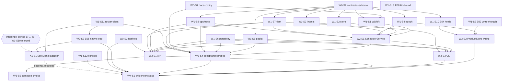

# SwarmAI → V2.3 implementation-complete: multitask plan

Companion to `AUDIT.md`. Baseline: `origin/dev` @ `8e1c0fdec24c131e7612d88076220945230f4c3b`, `origin/main` @ `08b910f981eff2ab66873a71055090f2c60f2a91`.
Target: every item of the "V2.3 implementation-complete" checklist (`docs/coordination/FUTURE_VERSION_EXIT_CHECKLISTS_20260921.md`) true on `dev`, with ART-V23 acceptance items 1–10 as a frozen deterministic harness and multi-process/private live evidence **honestly pending** (assumptions A1–A4 in AUDIT.md §3.3).

## 1. Operating rules for every session
- Branch from `origin/dev`; PR base `dev`; draft PR; never `main`, never merge, never force-push.
- One session = one branch = one PR = the files listed in its prompt. Nothing else.
- Only **SW-W0-S2** adds an Alembic migration or edits `src/swarm/db/models.py`. Only **SW-W0-S1 / SW-W4-S1** edit `docs/agents/*`, `docs/v2.3/STATUS.md`, `CHANGELOG.md`, `README.md`. Every session writes its own handoff `docs/v2.3/sessions/<SESSION_ID>.md` (disjoint files, no conflicts).
- A session starts only when every dependency's files exist on `origin/dev` (each prompt gives the exact `git cat-file -e` checks). The coordinator merges a wave's PRs after independent review (blocker B-02).
- Before every pytest run: `git clean -fdX -- var/` (F-15: stale `var/api/idempotency.json` makes re-runs fail). Before every commit: `git checkout -- schemas/v1 docs/evidence/fix-004 var` (tests rewrite these tracked files).
- New test file basenames must be unique across `tests/` (several test dirs have no `__init__.py`; duplicate basenames break collection).
- Console worker drain/revoke (W1-S12) is coded against `POST /v1/workers/{worker_id}/drain` and `POST /v1/workers/{worker_id}/revoke`, which W3-S1 implements in `routes_v23.py`; until then the UI shows "not available" on 404.
- Zero spend. No real model calls. `accepted` flags stay false.

## 2. Waves

Sessions whose dependency list says **none** may start immediately, in parallel with Wave 0.

### Wave 0 — contracts, tracking, hotfixes (serialization point)
| Session | Title | Depends on | Est. size |
|---|---|---|---|
| SW-W0-S1 | Tracking reset, lift-pause record, honest V2.3 status, frozen scheduler policy + acceptance manifest | none (owner confirms B-01) | docs/JSON |
| SW-W0-S2 | V2.3 shared contracts (`contracts/v23.py`), `scheduling` package, ORM rows, **single migration** `a23opsplatform0001` | none | ~450 LOC |
| SW-W0-S3 | Security hotfixes: ops-events cross-project leak (F-01), Retry-After cap (F-06) | none | ~120 LOC |

### Wave 1 — independent building blocks (max parallelism; 13 sessions)
| Session | Title | Depends on |
|---|---|---|
| SW-W1-S1 | Weighted-deficit round-robin selector (pure, deterministic) | W0-S1, W0-S2 |
| SW-W1-S2 | Durable `SchedulingStore` (in-memory + PostgreSQL) | W0-S2 |
| SW-W1-S3 | `DispatchIntent` reservation/compensation service | W0-S2 |
| SW-W1-S4 | Scheduler epoch lease + singleton ticker (V20-E06 infra, V23A-003b) | W0-S2 |
| SW-W1-S5 | Capability-pack lifecycle + keyed HMAC signing (F-02) | W0-S2 |
| SW-W1-S6 | Portability bundle v2 (history/receipts/knowledge/tombstones, remap, compat, value-based secret scan) (F-03) | none |
| SW-W1-S7 | Fleet trust classes (ART names) + drain state machine + deterministic placement | W0-S2 |
| SW-W1-S8 | Durable ops-event sink + trace graph + nested redaction | W0-S2 |
| SW-W1-S9 | V20-E03 pursuit PostgreSQL write-through store | none |
| SW-W1-S10 | V20-E04 durable usage holds + pursuit lessons stores (F-04) | W0-S2 |
| SW-W1-S11 | inference_server HTTP client + fake router fixture (packet P05; V20-E05/E07 enabler) | none |
| SW-W1-S12 | Console: Ops tab (read-only) + worker drain/revoke parity (V20-E09) | none |
| SW-W1-S13 | V20-E08 sandbox cancel kill-bound (process group, ≤10 s) — optional | none |

### Wave 2 — integration of the scheduler and native loop
| Session | Title | Depends on |
|---|---|---|
| SW-W2-S1 | `SchedulerService` (WDRR + store + intents + epochs + site epoch + receipts + ops events) + pathological suite; rewire `ResourceAllocator` | W1-S1, W1-S2, W1-S3, W1-S4, W1-S7, W1-S8 |
| SW-W2-S2 | V20-E05 bounded native model/tool loop behind fake router; honest V20-E07 blocked path | W1-S11 |

### Wave 3 — product surfaces and acceptance harness
| Session | Title | Depends on |
|---|---|---|
| SW-W3-S1 | API: `routes_v23.py` (scheduler/ops/trace/packs/portability/fleet + worker drain/revoke by path) + `app.py` wiring; durable only with `SWARM_V23_DURABLE=1` | W2-S1, W1-S5, W1-S6, W1-S7, W1-S8, W0-S3 |
| SW-W3-S2 | ProductStore durability wiring: E03 write-through, E04 holds/lessons restore, E06 singleton pursuit ticker | W1-S4, W1-S9, W1-S10 |
| SW-W3-S3 | Offline CLI `swarm v23 …` (policy, simulate, pack sign/verify, export/import) in `cli_v23.py` + 3 hook edits in `cli.py` | W2-S1, W1-S5, W1-S6, W1-S7 |
| SW-W3-S4 | V2.3 deterministic acceptance probes A01–A10 (`acceptance/v23_probes.py` + tests) | W2-S1, W1-S5, W1-S6, W1-S7, W1-S8, W1-S11, W0-S1 |
| SW-W3-S5 | V20-E10 product compose full-path smoke (Docker; honest `blocked_env_no_docker`) — optional | W3-S1 |

### Wave X — cross-repo, gated on inference_server (runs in parallel with Wave 3/4)
| Session | Title | Depends on |
|---|---|---|
| SW-X1-S1 | SplitSignal consumer adapter (`SplitSignalClient` subclass of `RouterClient`; `SPLITSIGNAL_*` env wins in `native_loop_from_env`; D-SS1) | W1-S11, W2-S2, **external SP1** (IS-W1-S10 merged into `cursor/is-v23-integration`) |

SW-X1-S1 is **not** a dependency of W4-S1. If it is merged first, W4-S1 records the adapter as `done (fake SplitSignal; live pending SP4)`, otherwise as `pending (gate SP1)`. Its owned files overlap no Wave 3/4 session: `native_loop.py` and `test_v20_native_loop.py` belong to W2-S2, which must be merged before it starts.

### Wave 4 — serialization: evidence, status, candidate
| Session | Title | Depends on |
|---|---|---|
| SW-W4-S1 | Campaign runner, evidence under `docs/evidence/v23/`, exit checklist with citations, status/agents/CHANGELOG/README update, CandidateManifest schema constant (F-14), admin-gate candidate freeze (F-16) | all required sessions merged (W3-S5, W1-S13 optional) |

Then owner gates: independent review (B-03) → optional multi-process/private run (B-04) → dev→main merge + tag (B-07).

## 3. Dependency graph

Critical path: W0-S2 → W1-S1/S2/S3/S4/S7/S8 → W2-S1 → W3-S1/S3/S4 → W4-S1 (5 merge rounds). Maximum concurrency: Wave 0 + "none"-dependency Wave 1 sessions = **9 sessions at once** (W0-S1, W0-S2, W0-S3, W1-S6, W1-S9, W1-S11, W1-S12, W1-S13 + one spare), then 7 more when W0-S2 lands.

## 4. File-ownership matrix
"C" = create, "M" = modify. No file appears under two sessions that can run at the same time. The only sequential overlap is SW-X1-S1: it modifies three files created by W1-S11/W2-S2, and it starts only after both are merged. Handoff files `docs/v2.3/sessions/<ID>.md` are owned by their session and omitted below.

| Session | Owned files |
|---|---|
| SW-W0-S1 | M `docs/agents/CURRENT.md`, M `docs/agents/context.json`, M `docs/agents/RESUME.md`, M `docs/agents/V20_TODO.md`, M `docs/agents/README.md`, M `docs/v2.3/STATUS.md`, C `docs/v2.3/PLAN.md`, C `docs/v2.3/sessions/README.md`, M `docs/v3.0/STATUS.md`, M `CHANGELOG.md`, C `config/v23/scheduler_policy.v1.json`, C `benchmarks/v23_acceptance/scenarios.freeze.json` |
| SW-W0-S2 | C `src/swarm/contracts/v23.py`, C `src/swarm/scheduling/__init__.py`, C `src/swarm/scheduling/memory_store.py`, M `src/swarm/db/models.py` (append only), C `migrations/versions/a23opsplatform0001_v23_ops_platform.py`, M `tests/integration/db/test_action_receipts_durable.py` (`NEW_HEAD` constant only), C `tests/contracts/test_v23_contracts.py`, C `tests/controller/test_v23_store_memory.py`, C `tests/integration/db/test_v23_schema.py` |
| SW-W0-S3 | M `src/swarm/api/routes_v1.py` (only function `list_ops_events`), M `src/swarm/broker/retry.py`, C `tests/api/test_v23_ops_events_scope.py`, C `tests/broker/test_retry_after_cap.py` |
| SW-W1-S1 | C `src/swarm/scheduling/wdrr.py`, C `tests/controller/test_v23_wdrr.py` |
| SW-W1-S2 | C `src/swarm/scheduling/store.py` (`SqlSchedulingStore`), C `tests/integration/db/test_v23_store_sql.py` |
| SW-W1-S3 | C `src/swarm/scheduling/dispatch_intent.py`, C `tests/controller/test_v23_dispatch_intent.py` |
| SW-W1-S4 | C `src/swarm/scheduling/epoch.py`, C `src/swarm/scheduling/singleton.py`, C `tests/controller/test_v23_epoch.py`, C `tests/integration/db/test_v23_epoch_sql.py` |
| SW-W1-S5 | M `src/swarm/capabilities/__init__.py`, C `src/swarm/capabilities/signing.py`, C `src/swarm/capabilities/lifecycle.py`, C `tests/extensions/test_v23_pack_lifecycle.py`, C `tests/integration/db/test_v23_pack_installs_sql.py` |
| SW-W1-S6 | M `src/swarm/product/portability.py`, C `tests/portability/test_v23_bundle.py` |
| SW-W1-S7 | M `src/swarm/workers/fleet.py`, C `tests/workers/test_v23_fleet_policy.py` |
| SW-W1-S8 | M `src/swarm/observability/ops_events.py`, M `src/swarm/observability/__init__.py`, C `src/swarm/observability/trace_graph.py`, C `tests/controller/test_v23_ops_trace.py`, C `tests/integration/db/test_v23_ops_events_sql.py` |
| SW-W1-S9 | C `src/swarm/pursuit/pg_mirror.py`, M `src/swarm/pursuit/state_store.py`, C `tests/pursuit/test_v20_writethrough.py`, C `tests/integration/db/test_v20_pursuit_writethrough_sql.py` |
| SW-W1-S10 | C `src/swarm/pursuit/durable_accounting.py`, M `src/swarm/pursuit/accounting.py`, M `src/swarm/pursuit/learning.py`, C `tests/pursuit/test_v20_unknown_usage_budget.py`, C `tests/pursuit/test_v20_durable_holds.py`, C `tests/integration/db/test_v20_holds_sql.py` |
| SW-W1-S11 | C `src/swarm/providers/router_client.py`, C `src/swarm/contracts/router_capabilities.py`, C `tests/fixtures/__init__.py`, C `tests/fixtures/router_http/__init__.py`, C `tests/fixtures/router_http/fake_router.py`, C `tests/providers/test_router_client.py`, C `config/router_context_overrides.example.json`, C `docs/swarm-mvp/INFERENCE_SERVER_CONTRACT_SNAPSHOT.md` |
| SW-W1-S12 | M `apps/console/src/App.tsx`, M `apps/console/src/api/client.ts`, M `apps/console/src/api/types.ts`, M `apps/console/src/data/fixtures.ts`, C `apps/console/src/components/OpsPanel.tsx`, C `apps/console/src/components/WorkerControls.tsx`, C `apps/console/src/ops.test.tsx` |
| SW-W1-S13 | M `src/swarm/tools/sandbox_runner.py`, C `tests/tools/test_v20_cancel_killbound.py` |
| SW-W2-S1 | C `src/swarm/scheduling/service.py`, M `src/swarm/controller/resource_allocator.py`, C `tests/controller/v23_harness.py` (shared helper), C `tests/controller/test_v23_service.py`, C `tests/controller/test_v23_pathological.py`, C `tests/integration/db/test_v23_service_restart_sql.py` |
| SW-W2-S2 | C `src/swarm/pursuit/native_loop.py`, M `src/swarm/pursuit/native_dispatch.py`, C `tests/pursuit/test_v20_native_loop.py` |
| SW-X1-S1 | C `src/swarm/providers/splitsignal_client.py`, C `tests/fixtures/splitsignal_http/__init__.py`, C `tests/fixtures/splitsignal_http/fake_splitsignal.py`, C `tests/providers/test_splitsignal_client.py`, C `tests/pursuit/test_v20_native_loop_splitsignal.py`, M `src/swarm/pursuit/native_loop.py` (one import + `native_loop_from_env`; after W2-S2), M `tests/pursuit/test_v20_native_loop.py` (one `delenv` line; F-19), M `docs/swarm-mvp/INFERENCE_SERVER_CONTRACT_SNAPSHOT.md` (append a section; after W1-S11) |
| SW-W3-S1 | C `src/swarm/api/routes_v23.py`, M `src/swarm/api/app.py`, C `tests/api/test_v23_routes.py`, C `tests/integration/db/test_v23_routes_durable_sql.py` |
| SW-W3-S2 | M `src/swarm/api/store.py`, M `src/swarm/pursuit/loop.py`, C `tests/product/test_v20_durable_wiring.py`, C `tests/integration/db/test_v20_durable_wiring_sql.py` |
| SW-W3-S3 | C `src/swarm/cli_v23.py`, M `src/swarm/cli.py` (3 hook edits only), C `tests/product/test_v23_cli.py` |
| SW-W3-S4 | C `src/swarm/acceptance/v23_probes.py`, C `tests/acceptance/test_v23_acceptance.py` |
| SW-W3-S5 | C `scripts/v20_compose_smoke.sh`, C `docs/evidence/v20/compose-smoke/README.md`, C `docs/evidence/v20/compose-smoke/latest.json` |
| SW-W4-S1 | C `scripts/v23_acceptance_campaign.py`, C `docs/evidence/v23/**`, C `docs/v2.3/EXIT_CHECKLIST.md`, M `docs/v2.3/STATUS.md`, M `docs/v2.0/STATUS.md`, M `docs/agents/*`, M `CHANGELOG.md`, M `README.md`, M `src/swarm/release/candidate.py` (add `CURRENT_SCHEMA_REVISION`), M `src/swarm/cli.py` + `src/swarm/api/routes_v1.py` (replace the literal `"a18tov30schema0001"` with that constant; admin-gate `POST /v1/release/candidate-freeze`; F-14, F-16), C `tests/release/test_schema_revision.py` |

### Serialization points (single owner, do not parallelize)
1. `src/swarm/db/models.py` + `migrations/versions/*` — SW-W0-S2 only (one new head `a23opsplatform0001`).
2. `src/swarm/contracts/v23.py` — SW-W0-S2 creates; later sessions **import only**. If a session needs a new field, it records "Needs other owner" in its handoff; the coordinator schedules a follow-up contract PR.
3. `src/swarm/api/app.py`, `src/swarm/api/store.py`, `src/swarm/cli.py` — Wave 3 single owners.
4. `docs/agents/*`, `docs/v2.3/STATUS.md`, `CHANGELOG.md` — W0-S1 then W4-S1.
5. `.github/workflows/ci.yml` — **nobody**. All new tests live in directories CI already runs (`tests/controller`, `tests/api`, `tests/broker`, `tests/extensions`, `tests/portability`, `tests/workers`, `tests/pursuit`, `tests/providers`, `tests/tools`, `tests/product`, `tests/acceptance`, `tests/contracts`, `tests/integration` with `pytestmark = pytest.mark.integration`).

### Frozen internal API shapes (W1-S12 console ↔ W3-S1 routes; parallel sessions code against these)
- `GET /v1/scheduler/queues` → `{"projects":[{project_id, tenant_id, weight, credit, running, max_concurrency, paused, version}]}` (non-admin: own projects only).
- `POST /v1/workers/{worker_id}/drain` and `/revoke`, body `{"reason": str}` → `{"worker_id", "drain_state"}`. Console treats 404 as "not available on this server". A worker with no `project_id` is admin-only. The legacy body-based `/v1/workers/drain|revoke` is unchanged.
- `GET /v1/ops/events` → `{"events":[...]}` (W0-S3 scoping); `GET /v1/ops/trace/{id}` → `TraceGraph.to_dict()`; a foreign trace gives 404.

### Durability flag (W3-S1 and W3-S2 share it; neither imports the other)
`SWARM_V23_DURABLE=1` **and** a reachable database switch the V2.3 scheduler/packs/ops state (W3-S1) and pursuit mirror/holds/lessons/ticker epoch (W3-S2) to PostgreSQL. Default off: behaviour is unchanged from `dev`. Turning it on in any environment is an operator decision.

### Validation of the reference code
Every session's code was compiled and run on a scratch clone (`dev @ 8e1c0fde` plus all 24 sessions applied in wave order). Result on the integrated tree: `uv run pytest` 763 passed / 1 skipped, the Postgres integration tests passed, ruff and mypy clean, 10/10 V23 probes pass. The W3-S5 Docker path was **not** executed (no Docker on the audit VM); only its `blocked_env_no_docker` path was. SW-X1-S1 was validated separately on `dev` plus the W1-S11 and W2-S2 references: the offline CI list gave 557 passed / 1 skipped, ruff and mypy were clean, and 25 new tests passed. Every fake SplitSignal body validates against the SplitSignal openapi schemas. It has not been run against the real `mock_splitsignal.py`, which does not exist on any inference_server branch yet.

## 5. Cross-repo touchpoints with `inference_server`
SwarmAI is a **client only**; no session edits `inference_server` (rule from `docs/swarm-mvp/START_HERE.md`).

| Touchpoint | SwarmAI side | inference_server side (observed @ `cursor/v08-v17-offline-ladder-7ebe` `96af9d4`, plan-pinned `release/v1-build` `bb6b6167`) | Needed from inference_server |
|---|---|---|---|
| Model catalog | `providers/router_client.py::RouterClient.list_models()` (W1-S11) | `GET /v1/models` → `{"object":"list","data":[…]}` per principal | **Additive fields** per model: `context_window`, `max_output_tokens`, `tokenizer`, `supports_tools`, `supports_json`, `billing` (`free`/`paid`/`unknown`). Until then SwarmAI uses `config/router_context_overrides.example.json`. |
| Chat | `RouterClient.chat()` / `chat_stream()` (W1-S11), used by `pursuit/native_loop.py` (W2-S2) | `POST /v1/chat/completions` (OpenAI-compatible, stream + non-stream, tool calls) | Stable tool-call ID preservation; documented `stream_options.include_usage`. |
| Route identity & billing | parse headers into `RouterCallReceipt` | `X-Request-Id`, `X-Router-Route`, `X-Router-Provider`, `X-Router-Upstream-Model`, `X-Router-Billing`, `X-Router-Attempts`, `Retry-After` | Header names frozen as a versioned contract (e.g. `X-Router-Contract: 1`). |
| Errors | map `error.code` → `swarm.contracts.enums.ErrorClass` | `{"error":{"type","code","message"}}`; codes such as `upstream_*`, `deadline_exceeded`, `credential_missing` | Published list of stable codes + which are safe to retry. |
| Retries/fallback ownership | SwarmAI disables HTTP-library retries; semantic retry only via `RetryOwner` (cap from W0-S3) | Router owns transport retry + alias fallback (bounded attempts/deadline) | Confirm max router-side attempts per request so SwarmAI accounting does not multiply. |
| Usage/cost | known vs unknown usage in `RouterCallReceipt`; unknown never = 0 (feeds E04 holds) | `usage` in body (may be absent); `GET /v1/router/usage` ledger (metadata only) | Idempotency-Key header support (unknown) for reconciliation after timeout. |
| Zero-spend | Swarm admits only `X-Router-Billing: free`; anything else → `paid_route_forbidden` | Default policy "free only", fail-closed | None (aligned). |
| MCP mailbox | out of scope for V2.3 | `/mcp`, `/v1/mailbox/*` | none now. |
| Live use | blocked (B-05, LiveGrant) | router needs owner credentials; no route billing-qualified yet | Owner decision. |

Coordination action for the inference_server coordinator/auditor: propose an additive "capability metadata v1" on `GET /v1/models` and freeze the header set. SwarmAI does not block on it (fixture + override file).

### 5.1 SplitSignal consumer contract (supersedes the legacy router rows above)
The inference_server V2.3 plan (`/agent/audit/inference_server/PLAN.md` §8, owner decision D3) makes SplitSignal SwarmAI's **only** inference dependency: an OpenAI-compatible API with a SplitSignal-issued key. The personal router is retired (X6). W1-S11/W2-S2 stay useful: they build the client types, the native loop and the legacy fake. **SW-X1-S1** adds the SplitSignal adapter on top.

| SplitSignal contract fact (openapi 1.0.0, `swarmai-consumer 1.x`) | SwarmAI mapping in SW-X1-S1 |
|---|---|
| `SPLITSIGNAL_BASE_URL` (ends in `/v1`), `SPLITSIGNAL_API_KEY` (bearer `ss_live_…`), `SPLITSIGNAL_MODEL` | `SplitSignalClient(base_url)` strips `/v1`; `api_key_env="SPLITSIGNAL_API_KEY"`; `native_loop_from_env` prefers `SPLITSIGNAL_*` over `SWARM_ROUTER_*` |
| `GET /v1/models` → `V1ModelList{data:[{id: RouteId, owned_by}]}` (only routes usable now; M1 dispatches only `cost_class: free`) | `RouteCapabilities(model_id=id, billing=FREE, admission="admitted")` under **D-SS1**; a `ModelPage{items:[ModelOffer]}` body is also accepted, and its `cost_class`, `capabilities.tools/json_output` (`supported` → True) and `limits.*.value` are then authoritative |
| `ChatCompletion.model` = `X-SplitSignal-Served-Route`; `id` = request id; `usage` null if unreported; `splitsignal{requested_route, served_route, attempt_count, usage, cost{amount,currency,source}}` | `RouterCallReceipt(route_id, provider, upstream_model, attempts, usage_known)`; a known non-zero `cost.amount` → `policy_denied/paid_route_forbidden` with `billing: paid` |
| SSE: content chunks, a finish chunk with `splitsignal`, a usage chunk (`choices: []`), `[DONE]`; a failure after headers is `event: error` + `ErrorEnvelope`, with no `[DONE]` | the receipt is rebuilt from chunks; a missing `[DONE]` → `partial_stream` with `partial_text` |
| `ErrorEnvelope{error:{code, message, request_id, retryable, retry_after_s?, field_paths?}}`, `X-Should-Retry: false`, `Retry-After` on 429/503 | `classify_splitsignal_error`: fixed code map; any other 5xx with `retryable: false` → `unknown_outcome`; `retry_after_s` from the header. SwarmAI never replays after a 200 header; semantic retry stays with `RetryOwner` (cap from W0-S3). |

| inference_server sync point | Meaning | SwarmAI consequence |
|---|---|---|
| SP1 contract frozen | IS-W1-S10 merged into `cursor/is-v23-integration` | SW-X1-S1 may start (its Step 0 checks this with `gh api`) |
| SP2 mock testable | `scripts/mock_splitsignal.py` on the integration branch | SW-X1-S1 Step 8 (optional) runs the adapter against the real mock on port 8089 |
| SP3 key issuable | `import-key --label swarmai` recorded on the hosted DB | owner stores `SPLITSIGNAL_API_KEY` as a Cursor Secret (no session does this) |
| SP4 live non-streaming / SP5 streaming | hosted smoke passed | still needs a LiveGrant (B-05); first live call is an owner-approved action outside this plan |
| SP6 joint V2.3 finish | both evidence docs cite `swarmai-consumer 1.x` | W4-S1 exit checklist row "SplitSignal consumer adapter" cites the contract version |

Report to the inference_server coordinator: F-20. IS-W1-S10's mock serves a `ModelPage` on `/v1/models`, but the openapi says `V1ModelList`. SwarmAI tolerates both.

## 6. Mapping of V2.3 checklist → sessions
| Checklist item | Sessions |
|---|---|
| scheduler state durable | W0-S2, W1-S2, W2-S1 |
| project-level fairness defined | W0-S1 (policy), W1-S1 |
| aging/priority deterministic | W1-S1 |
| reservation intent transactional/fail-closed | W1-S3, W2-S1 |
| provider/worker/tool capacity integrated | W2-S1 (via injected reserve/release callables), W3-S1 |
| backpressure bounded | W1-S1 (caps), W2-S1 (queue depth/fan-out) |
| cancellation/drain fenced | W1-S1, W1-S3, W1-S7, W2-S1 |
| scheduler bound to SiteEpoch | W1-S4, W2-S1 |
| decision receipts emitted | W0-S2, W1-S2, W2-S1 |
| capability packs lifecycle complete | W1-S5 |
| portability export/import complete | W1-S6 |
| observability read surface complete | W0-S3, W1-S8, W3-S1, W1-S12 |
| dashboard mutation uses action boundary | W3-S1, W1-S12 |
| fleet placement/trust/locality complete | W1-S7 |
| pathological deterministic suite passes | W2-S1, W3-S4 |
| multi-process/private evidence complete or honestly pending | W4-S1 (records pending; B-04) |

V2.0 depth prerequisites: E03 → W1-S9 + W3-S2; E04 → W1-S10 + W3-S2; E05 → W1-S11 + W2-S2 (+ SW-X1-S1 for SplitSignal); E06 → W1-S4 + W3-S2; E07 → W2-S2 + SW-X1-S1 (fake/free first; live blocked on SP4 + LiveGrant); E08 → W1-S13; E09 → W1-S12; E10 → W3-S5; E11 deferred.

## 7. Prompts
One file per session in `prompts/`: `SW-W0-S1.md` … `SW-W4-S1.md` plus `SW-X1-S1.md` (25 files). Each is self-contained: rules, setup, dependency checks, owned files, step-by-step code, verification commands, acceptance checkboxes, do-not-touch list, commit message, push + draft PR, handoff, blocked procedure.
